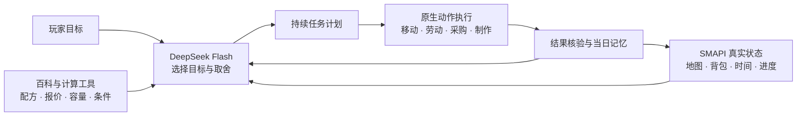

<div align="center">

# 同行 · Together

### 把一句「帮我经营农场」，变成星露谷里的真实行动。

**面向自主经营、任务与全成就推进的游戏 Agent，也是一位随时可以接手工作的游玩助手。**

`Stardew Valley` · `SMAPI` · `DeepSeek Flash` · `C#`

[快速开始](#快速开始) · [工作原理](#工作原理) · [开发文档](#开发与文档) · [团队](#团队)

</div>

---

你定目标，同行负责理解世界、安排工作、调用工具，再检查事情是否真的完成。

从整理第一块农田，到采购、种植、收获、变现与再投资；从一封新邮件，到任务前置、区域解锁与成就进度——我们希望 AI 能理解一整段游戏生活，并把长期目标落实成今天可以执行的一步。

你可以让它自主经营，也可以只交给它一件事，随时接回控制继续玩。

## 想怎么玩，由你决定

| 玩法 | 你提出目标 | 同行的工作方式 |
| --- | --- | --- |
| 自主经营 | 「把农场经营起来，收入用来继续发展。」 | 读取作物、库存、现金和时间，选择工作，执行并记录实际结果。 |
| 任务与成就 | 「看看下一步能推进什么。」 | 查询原生任务、收集与解锁进度，展开已适配的前置条件和材料需求。 |
| 游玩助手 | 「帮我照顾这片田，我回来再接着玩。」 | 连续完成农活、拾取、补水与必要整备，支持暂停和接管。 |
| 游戏百科 | 「这份材料能做什么？现在能种什么？」 | 查询游戏数据中的物品、配方、作物与条件，把依据交给玩家和模型。 |

自主控制玩家是当前主要运行形态。全成就闭环、自定义伙伴协作与中后期完整生产链仍在持续完善。

## 不只会聊天，还能把工作做下去

**经营有依据。** 商店真实报价、作物成熟日期、实际库存和配方共同参与决策。AI 选择目标、品种与投资方向，程序负责数量计算、条件检查和执行。

**劳动能连续。** 寻路、工具选择、批量农活、掉落拾取与库存整备由执行器衔接。模型不必为每一步移动、每次挥锄重新发指令。

**进度有记忆。** 当天买了什么、种了什么、哪些工作已经完成，进入事实记录。相同条件下的失败合并保存，附带解除条件；历史叙述不会代替当前真实库存。

**过程看得见。** 游戏内常驻面板展示正在做什么、原因和下一步。完整模型请求、工具回执、动作与资源变化可留存，便于复盘每一次决策。

**结果靠核验。** 制作、购买、出货和过夜走原生流程。命令被接收不等于完成，物品与进度变化才是完成依据。

## 工作原理



大模型负责有意义的选择，算法负责可计算的细节。Together 直接通过 SMAPI 读取游戏状态，无需逐帧截图识别；正式运行也不依赖常驻 Python 决策服务。

工具层覆盖农务、清理采集、钓鱼、矿洞行动、商店交互、制作、存储、出货、任务查询与睡眠换日。各项能力的适配范围和原生验证记录保存在开发文档中。

## 从一块田，到全成就

全成就意味着把经营、收集、制作、关系和探索连接成长期计划，而不仅是连续执行一批劳动。

| 项目 | 时间与规模 |
| --- | --- |
| 玩家成就收集参考 | 基础 40 项成就约 **150–200 小时**；1.6 新增内容需另计。 |
| Together 全成就运行用时 | **153 小时**，Windows 运行。 |
| DeepSeek Flash 总用量（日志折算） | **1.7451 亿 token**，包含输入与输出。 |
| 完成全部成就的 API 总费用 | **人民币 213.3 元**。 |

用时与总费用来自维护者提供的 Windows 运行结果；Token 按既有运行日志折算。玩家耗时参考 [TrueAchievements](https://www.trueachievements.com/game/Stardew-Valley/completiontime)。

## 快速开始

当前已验证的开发环境：**macOS、Stardew Valley 1.6.15、SMAPI 4.5.2、.NET SDK 6、Python 3.11+**。需要自行安装游戏与 SMAPI，并准备 DeepSeek API Key。

```bash
git clone --recurse-submodules https://github.com/Zsh123456-BOOP/stardew-together.git
cd stardew-together
cp .env.example .env
```

在本机 `.env` 填入模型配置：

```dotenv
DEEPSEEK_API_KEY=你的密钥
DEEPSEEK_MODEL=deepseek-flash
DEEPSEEK_BASE_URL=https://api.deepseek.com
```

准备固定版本的上游源码，构建并启动独立 Mod 环境：

```bash
python3 scripts/prepare_companion_sources.py --remove-squad-tests
python3 scripts/build_companion.py
python3 scripts/launch.py --companion --keep-window
```

游戏目录不在默认位置时，设置 `STARDEW_GAME_PATH`；需要指定 SDK 时，设置 `DOTNET`。构建产物写入项目的 `work/`，不覆盖原有游戏 Mods。

进入存档后，按 **F8** 打开同行，进入自主游玩并填写目标。按 **F10** 可暂停接管。右侧半透明面板支持滚动，便于查看当前安排。

API Key 只保存在本机，`.env`、存档、日志与运行产物均不进入 Git。模型用量会记录；运行配置中的 `ModelTokenBudgetPerDay: 0` 表示不设置每日 token 上限。

## 开发与文档

| 目录 | 内容 |
| --- | --- |
| `mod/Together/` | 模型决策、任务调度、经营工具、百科、记忆与游戏内界面 |
| `mod/SquadAdapter/` | Squad 伙伴控制适配 |
| `mod/AgentBridge/` | 游戏状态与控制桥接 |
| `scripts/` | 固定依赖准备、构建、打包、启动与验证工具 |
| `tests/` | 纯算法与协议检查 |
| `docs/` | 设计、开发记录与原生验证证据索引 |
| `vendor/Farmtronics/` | 固定版本的 Farmtronics 子模块 |

- [产品设计](docs/同行完整设计方案.md)
- [自主通关开发方案与复用清单](docs/自主通关开发方案与复用清单.md)
- [百科与知识检索](docs/同行百科与知识检索方案.md)
- [原生目标续作与背包处理](docs/第十二轮目标续作与背包处置修复记录.md)
- [来源与许可说明](docs/同行来源说明.md)

算法检查可运行 `dotnet run --project tests/Together.DomainChecks.csproj`。原生夹具只在开启 Lab 模式、世界就绪且角色名为 `AgentLab` 时执行，不用于正常经营存档。

当前重点是长期运行稳定性、生产链衔接与任务/成就覆盖；伙伴双身体协作作为后续方向推进。每项能力以真实游戏结果验收，不直接修改经验、金钱、成就或统计计数来替代行动。

## 团队

[Zsh123456-BOOP](https://github.com/Zsh123456-BOOP) · [LHBVv](https://github.com/LHBVv) · [zsq040123-cloud](https://github.com/zsq040123-cloud)

## 开源基础

Together 复用 [The Stardew Squad](https://github.com/Isalda/the-stardew-squad) 的伙伴与导航基础，以及 [Farmtronics](https://github.com/JoeStrout/Farmtronics) 的机器人原型；同时参考 [StardewValley-MCP](https://github.com/amarisaster/StardewValley-MCP) 与 [StardewValleyAIDialogueMod](https://github.com/phenyisole/StardewValleyAIDialogueMod) 的设计。

依赖版本见 [`configs/companion-upstreams.json`](configs/companion-upstreams.json) 与 Git 子模块记录。上游来源及许可证随对应代码保留。
