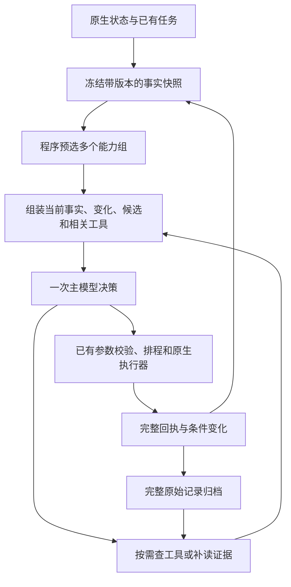

# Agent 输入与工具路由优化调研方案

实施状态：R1/R2与一日原生复测已完成，结果与未达目标见 [实施与一天复测](Agent输入优化实施与一天复测-20260922.md)。R3协议迁移及新一日复测也已完成，见 [原生工具与经营决策复测](Agent原生工具与经营决策优化复测-20260922.md)；最新输入中位数11,122，比最初低12.7%，但高于第一轮9,967，尚未达到成本目标。

日期：2026-09-22。范围：针对 Together 当前 DeepSeek 自主经营循环，调研工具选择、状态组织、记忆与输出协议，给出可实施方案。本轮只做调研、日志统计和方案，没有修改运行代码、调用游戏模型、部署或启动新基线。此前四个文件中的本地解析修复保留原样，尚未提交。

**建议采用：程序按真实状态预选多个能力组，主模型保留跨领域取舍和按需扩展权；同时把输入改为“当前事实＋关键变化＋可选工作＋相关工具”。先整理上下文，再减少常驻工具，最后独立验证 API Tool Calls。暂不引入每轮额外的分类模型、向量库或新的多 Agent 调度层。**

## 1. 现有问题与实测基线

固定样本是春 1 日 10:00 的真实请求，call `2abd38992e684cf0aa9abdf12adcb1ce`，run `5588b4f9c4da4c918aa9b0034508517f`。原始材料：[完整调用对照](../work/operating-loop-three-day-baseline-2/request-response-inspection/00-阅读这次真实调用.md)、[最终输入](../work/operating-loop-three-day-baseline-2/request-response-inspection/02-final-user-input.json)、[请求体](../work/operating-loop-three-day-baseline-2/request-response-inspection/03-http-request-body.json)。

| 组成 | 字符数 | 当前问题 | 拟改法 |
| --- | ---: | --- | --- |
| 46 个常驻工具定义 | 9,625 | 与本轮无关的完整参数也每次发送；work.run 单项约 2,069 字符 | 小型基础集＋当前能力组；完整定义按需装入 |
| 10 条待交付回执 | 7,177 | 每条重复信封；旧排程、旧计划与新终态并排 | 共享信封、按实体版本处理过期结果、分组保留终态 |
| 发展前置 | 5,008 | 6 个配方、任务、成就、建筑一起进入保护区 | 当前目标依赖＋新解锁＋有依据的发展方向；其余可查 |
| 记忆 | 4,432 | 失败规则 1,426；当日活动 2,834；与回执/现状重复 | 未解决约束＋当日净进展；完整历史归档 |
| 固定行为规则及分隔文字 | 2,157 | 全局约束和各业务操作细则混写 | 全局短规则固定；业务细则随能力组加载 |
| 当前状态及背包 | 1,642 | 必要，但其他段落还会重复其内容 | 作为权威现状保留一份 |
| 当前任务进度 | 992 | 与发展前置的任务信息重复 | 合并到目标进展和可选工作 |
| 其他字段及 JSON 结构 | 3,436 | 多份补读入口、目标、诊断字段 | 单一目标卡；诊断数据主要留日志 |
| **合计** | **34,469** | **工具、回执、发展、记忆四项占 76.1%** | 不只压缩工具定义 |

同一轮独立基线共有 27 次完整请求/响应，重新按服务端 usage 和 trace 时间统计：

| 指标 | 实测 |
| --- | ---: |
| 输入字符中位数 / p95 / 最大 | 31,985 / 35,426 / 35,898 |
| API 输入 token 中位数 / p95 / 最大 | 12,733 / 13,998 / 14,157 |
| 输入 token 累计 | 348,384 |
| 输出 token 中位数 / 累计 | 299 / 8,419 |
| 请求至响应时间中位数 / p95 | 2.431 秒 / 3.185 秒 |
| 输入缓存命中比例 | 45.15% |
| 严格 JSON 解析失败 | 4/27；最后三次连续失败后暂停 |

p95 使用 nearest-rank；这是未完成游戏日的诊断样本，不能外推完整经营质量。统计文件：[call-size-baseline.json](../work/operating-loop-three-day-baseline-2/request-response-inspection/call-size-baseline.json)。字符数、项目估算 token、API 实际 token 三种单位不混用。

有两个相互独立的问题：

- **事实优先级错误**：10:00 的当前状态、任务卡和终态已表示社交完成、活动任务为空；09:40 查询仍显示旧的 running/queued，模型沿用了旧说法。时间戳存在，但程序让模型自己解决了这组本可确定的冲突。
- **格式失败**：API 在完整 JSON 后返回多余 `</result>` 或 `"}`。不能把它归因于上下文长度；该轮 HTTP 200、finish_reason=stop，输出也没有达到上限。输入优化与协议修复分别验证。

## 2. 开源实现怎样处理

本轮使用 Exa，沿工具路由、上下文与记忆、输出协议与缓存三个方向检索；9 次搜索返回 45 条结果，按 URL 去重为 43 个入口。入口数量不等于全部精读或独立证据数量；下表只采用已核对的官方文档和公开源码，未使用第三方效果排名。

| 项目 | 核实的机制 | 对本项目的借鉴 | 使用限制 |
| --- | --- | --- | --- |
| LangChain | `wrap_model_call` 可按状态过滤工具；`LLMToolSelectorMiddleware` 则先调用一个模型，再把选中工具交给主模型；支持常驻工具和数量限制 | 区分“程序过滤”与“模型分类”，将工具暴露从执行器中分离 | 模型选择器增加串行请求。所查源码读取最后一条 user message；直接套用我们的 22,687 字符输入，分类请求本身仍很大 |
| AgentScope | Toolkit 将工具放入组；basic 常驻，其他组可激活/关闭；模型可用元工具切换组并获得使用说明 | 最贴近本项目：基础工具＋农务/交易/资源等能力组，组说明随需出现 | v1.0.21 文档名为 reset_equipped_tools；所查新版源码名为 reset_tools，不能混用接口版本。工具被隐藏与工具获准执行是两件事 |
| Deep Agents | skills 先暴露名称/简介，相关时读取正文；大工具结果外置，上下文只保留预览与读取入口；必要时再摘要 | 业务长说明按需加载；复用我们已有 query.read/MemoryArchive 保存完整证据 | 仅给读取指针会增加往返；应保留足以做当前决定的语义摘要，不能机械照搬通用文件预览 |
| OpenHands SDK | 原始事件与发给模型的 View 分离；Condenser 可保留首尾、总结中段，并以事件记录被压缩的内容 | 原始回执继续完整保存，决策视图单独组织；历史不必逐条常驻 | 其默认 LLM 摘要会额外调用模型；游戏现金、库存、终态更适合确定性归并，不能交给自由摘要改写 |
| LlamaIndex | ObjectIndex/ObjectRetriever 可索引工具元数据，按查询检索候选工具再路由 | 工具非常多、领域开放时可用检索辅助缩小范围；索引也可用关键词 | 官方示例是查询引擎路由，并非游戏动作控制；向量相似度不等于当前可执行性。本项目规则要求不引入向量库 |
| smolagents | 保留 ActionStep 等过程记录，再投影为模型消息；支持回调修改模型记忆，CodeAgent 另有输出长度控制 | 学习“完整运行记录”与“每次输入”分离 | 不建议迁移为任意代码执行：现有原生游戏线程、菜单和保存事务需要继续由 C# 执行器掌控 |

来源分别为：[LangChain 动态上下文](https://docs.langchain.com/oss/python/langchain/context-engineering)、[选择器文档](https://reference.langchain.com/python/langchain/agents/middleware/tool_selection/LLMToolSelectorMiddleware)、[选择器固定版本源码](https://github.com/langchain-ai/langchain/blob/bee470cc29fec53216891f71e47217ee4eec3694/libs/langchain_v1/langchain/agents/middleware/tool_selection.py)；[AgentScope v1.0.21](https://docs.agentscope.io/versions/1.0.21/en/building-blocks/tool-capabilities)、[元工具源码](https://github.com/agentscope-ai/agentscope/blob/3a4e2ae3/src/agentscope/tool/_builtin/_meta.py)；[Deep Agents Skills](https://docs.langchain.com/oss/python/deepagents/skills)、[上下文管理说明](https://www.langchain.com/blog/context-management-for-deepagents)、[外置结果源码](https://github.com/langchain-ai/deepagents/blob/51c5fa4e7b38b2112ea78fccb3585bf7a854faa9/libs/deepagents/deepagents/middleware/filesystem.py)；[OpenHands Condenser](https://docs.openhands.dev/sdk/arch/condenser.md)；[LlamaIndex 工具检索路由](https://developers.llamaindex.ai/python/examples/query_engine/retrieverrouterqueryengine/)；[smolagents 记忆](https://huggingface.co/docs/smolagents/en/tutorials/memory)、[Agent 接口](https://huggingface.co/docs/smolagents/en/reference/agents)。这些实现证实机制存在，不证明套用后会提高本游戏的经营收益。

## 3. 工具调用前要不要先分类

**要做能力分类；默认由程序使用已知状态预选多个组。主模型直接在这些组里决策，缺能力时再扩展。**

| 路线 | 好处 | 代价与风险 | 建议 |
| --- | --- | --- | --- |
| 每轮全部工具 | 简单、不会因路由漏工具 | 输入大、工具之间相互干扰 | 保留为对照组 |
| 每轮分类模型 → 主模型 | 可理解模糊意图，适合开放领域 | 两次模型成本与延迟；分类也可能格式错误或漏工具 | 暂不作为默认 |
| 真实状态规则＋能力组＋模型补充 | 常见回合只需一次主模型；路由原因可审计 | 需要设计召回边界和扩展入口 | **推荐** |
| 元数据检索工具 | 适合大量动态工具 | 要评估召回；向量检索增加基础设施且不合本项目约定 | 先复用关键词、别名和分类索引 |
| 直接改为多 Agent 分工 | 可隔离专门任务的上下文 | 单玩家动作最终仍串行，增加状态同步和调度成本 | 当前不引入 |

程序预选的依据包括：当前菜单由谁拥有、真实作物缺项、背包与仓储约束、已选目标的依赖、有效报价、服务窗口、已解锁能力、刚结束的任务。它负责挑选相关工具，不能替模型决定“今天必须种地/买种/社交”。

不能把玩家位于 SeedShop 简化为只开放买卖，也不能因为没有鱼竿就永久隐藏领竿和解锁方向。应允许“补木材＋做箱子＋比较种子报价”同时存在；跨领域发展通过少量候选摘要和能力目录保持可见。

分类模型只作为后续可选方案：遇到本地分类规则覆盖不了的新能力或开放意图时，给它短任务摘要和能力组简介，不给整份大输入。只有对照实验表明收益超过额外调用成本才启用。延迟应比较“分类＋补读＋主模型＋重试”的总和，不能只报主模型变快。

## 4. 建议架构与职责



不引入独立 agent 框架替换现有循环。借鉴其边界划分，在 C# 内完成以下职责，避免新旧两套分类、压缩和记忆同时主导。

### 4.1 一个工具目录，多个暴露视图

扩展现有 AgentToolRegistry 元数据，而非再建一套名字不同的工具：内部名称、简短用途、所属能力组、完整参数契约、读写属性、所需上下文字段、相关能力/条件版本。AgentToolDiscovery、只读判定、工具路由逐步从同一元数据生成；先加一致性断言，再移除重复列表。

建议能力组：

| 组 | 典型工具/能力 | 预选依据 |
| --- | --- | --- |
| 基础控制与补读 | tools.lookup、context.read、query.read、plan.read/submit/cancel、agent.wait/pause、旅行与收工 | 常驻小集合；精确名单通过语料验证 |
| 农务 | 布局、清障、播种、浇水、收获 | 原生农务缺项、种子、已批准布局 |
| 材料采集 | wood/stone/fiber/resource 等原生工作 | 当前材料缺口和模型选定的备料目标 |
| 交易投资 | 开店、报价、选种、采购、出货 | 现货/待售物品、有效报价、购买意图 |
| 仓储制作 | 容量、存取、目标依赖、制作与部署 | 容量限制或已选制作目标 |
| 任务社交 | 接取、交付、奖励、greet 等 | 当前任务、真实窗口、模型选择 |
| 动物加工 | 饲料、照料、机器投料/收取、生产查询 | 已有动物/机器或相关发展目标 |
| 探索钓鱼 | 领竿、钓点、钓鱼、矿区/交通解锁 | 可见解锁方向、装备、已选目标 |

组允许重叠，不能规定每回合只能选一组。基础集约 8–10 项、常见回合完整定义合计约 12–20 项只是初始实验范围，菜单、回收控制、依赖闭包和模型主动扩展可以超过它。数量不能成为隐藏合法工作的硬门槛。

当前 work.run 是一个大参数集合，第一阶段不要为了省字直接剪掉参数说明。先减少无关工具并分离长操作指导；只有回放证明它仍是主要负担时，再做有限的类型化门面，所有门面仍落到同一原生实现，禁止复制控制器。

已加载组与目标、依赖关联，避免每帧开关造成缓存和上下文抖动。模型 tools.lookup 读到某工具后，其完整定义应在相关决策期间保留；任务完成或明确切换目标后再卸载。正在执行的任务不因工具从下一轮输入中隐藏而取消。

找不到能力时，始终可查看短能力目录或查找具体工具。返回定义后由模型按真实结果再决定，不猜参数自动重放失败动作。

### 4.2 用语义视图替代“先堆满、后删字段”

建议每次决策只有六块主要内容：

1. **目标与当前取舍**：全局目标一份；当前选定方向、暂缓事项及重评条件。
2. **权威现状**：时间、地点、现金、体力、实际库存、农场必要状态、当前队列；空队列明确表示为空。
3. **本轮重要变化**：最新终态、部分完成、服务约束变化、报价/奖励/成熟等；明确观测时间和实体版本。
4. **当前可选工作**：有依据的少量候选及不同方向的替代项，包括真实前提、缺口、窗口和是否只是未来准备。
5. **当前相关约束与依赖**：阻碍当前工作、影响取舍的条件；已解决约束不常驻。
6. **可用能力与补读入口**：当前组、工具定义，以及其余内容的可检索索引。

当前快照是现状的来源，旧计划文字是意图，不得再次复述为事实。旧 schedule 查询保留归档，并在视图中标为被新版本替代；模型明确询问历史时仍可取回。旧回执的“曾经发生”与旧查询的“当时状态”不能混为一类。

每个模块保留相关版本：库存、队列、目标、报价与服务条件。当前快照分帧采集时，对最终组装做版本一致性检查；不能仅以“有 pending_queries”为由放宽所有相关事实的校验。原生对象仍只在游戏线程读取，后台只处理不可变副本；避免为追求单份快照重新引入一帧扫描整个世界。

基础现状每轮自包含，不做依赖模型隐式记忆的纯差量传输。差量只用于突出变化、缩减历史。模型暂停恢复、换日和上下文重建均能从同一事实视图恢复。

### 4.3 回执和记忆的确定性归并

保留完整原始日志与稳定 result_id；模型视图采用短公共信封，说明和补读格式不在每条结果中重复。

相同原因可归组，但键必须包括任务种类、主体、物品/目标、地点与相关条件版本。不能仅按 `work.run + no_matching_targets` 把木材、矿石和纤维合成一条泛化禁令。每个成员仍可查 task_id、requested/completed/remaining、停止原因和恢复条件；0/5 与 2/5 必须保持区别。

当日活动默认给“实际已种15、已浇15、木材净获得44”等经过原生证据归并的结果。每一次拾取的长 command_id 留在详情层。数量合并必须区分新增、存取、出售和当前持有，不能把累计获得当当前库存。

明确区分请求已包含某观察、HTTP已返回、模型回复有效、动作已接纳和原生完成。当前 AcknowledgeQueries 在合法回复后才调用；连续格式失败会使同批数据继续重发。可新增传输状态用于诊断，但不能因 HTTP 200 就推断模型理解或直接丢弃未解决终态。格式重试使用最新现状、短错误提示和仍有必要的结果，避免复制整段失败输出。

被替代查询采用显式 superseded 状态与版本映射，不伪装为已完整交付；未解决的查询依赖继续保留。大批结果分批发送时记录真实包含的结果 ID，未放入请求的不确认交付。

### 4.4 保留经营视野，收缩无关发展资料

调整 ContextBudget 的保护优先级：当前事实、菜单归属、正在执行/新终态、有效报价、当前机会与必要约束优先。通用发展目录不再整块不可压缩。

TaskPrerequisites 不再按全局配方集合简单取前六项并逐项附上完整百科结果。优先当前目标依赖、刚解锁能力、真实瓶颈的解决方向；重复的 not_found 合并为“这些解锁条件尚未知，可补查”，不能改写成不可达。

保留短的跨领域发展概览，在新一天、任务完成、升级解锁、收入到账、服务变化等有意义事件后更新。当前执行受阻时可比较替代方向；不能只呈现已经能立即执行的工作，否则又会丢掉做箱子、领竿、升级等发展链。

当前机会摘要和工具依赖应一起组装：候选需要的工具必须可见或有直接加载入口，需要的现金/材料/窗口必须在同一份事实视图中。候选上限只是展示预算，模型仍可选择候选之外的合法工作。

同一 section/参数/相关版本的查询可复用已捕获结果；版本改变则重新读取。普通补读只返回被请求字段，并尽量一次满足下一决策所需信息。不要将查回的一整块世界快照再次永久加入输入，也不要因重复查询就自动睡觉。

### 4.5 本次 10:00 输入应该怎样呈现

下面是基于本次已记录事实的**拟议展示样式**，用于说明组织方式，不是已经生成或发给模型的新请求；实际实现还必须带稳定身份、条件版本及当前组的完整参数定义。

```text
目标：正常时间自主经营；由你决定采购、劳动、发展和收工。

当前：春1 10:00，SeedShop，现金500，体力118；背包空3格。
物品：木44、石6、纤维10、树液12；基础工具在包中。
农务：15株已种、15株已湿；当前活动任务0。

新结果：社交已成功结束；5个资源任务以no_matching_targets结束，新增量均0。
各失败任务的目标、地点、条件版本与原始回执可展开，不能视为全行业禁令。
09:40的旧排程已经过期，不再代表当前还有任务运行。

待取舍：
- 是否解决仓储容量：已有木44，核验箱子配方及缺口后决定是否补料制作。
- 是否扩种：现金500，当前输入未提供有效种子报价，需原生开店核价。
- 是否继续其他活动：可查看跨领域机会；已有作物今天不需再浇水。

相关能力：交易、材料、仓储制作；基础控制始终可用。
其他能力：农务、任务社交、动物加工、探索钓鱼，可按需加载。
```

模型决定做箱子时再带入配方依赖；获得原生报价时再带入作物比较与预算。它仍可以选择其他活动或暂缓投资。程序不预设购买数量、不自动把118体力解释成必须继续劳动，也不将3个空格直接解释为不能购买可堆叠种子。

## 5. 输出协议和提示词

系统提示保留少量全局规则：原生事实优先、意图不等于完成、正常时间、当前角色、真实现金/物品约束、已运行任务的关系、需要新结果的动作必须等待。各业务使用细则随组加载。计划字段只记录本次改变的取舍和重评条件，不要求每轮重写一篇当天叙事；相关方案可以通过稳定 plan_id 续接。

建议把 API Tool Calls 作为独立工作包验证。DeepSeek 官方提供 `tools`、响应 `tool_calls` 以及 `tool_call_id` 配对；strict 模式当前在 Beta 入口，要求每个 function 开 strict，并满足其支持的 Schema 子集。[官方 Tool Calls](https://api-docs.deepseek.com/guides/tool_calls/)

迁移必须包含：

- 从同一工具元数据生成类型化 Schema；参数契约仍由本地校验，不能以 Schema 合法代表余额、地点或原生事务可执行。
- 内部含点号的工具名称与供应商接受的名称采用明确的一对一映射，并做往返/冲突检查。
- 识别 `finish_reason=tool_calls`，保留供应商 call_id；回填结果时维持调用与工具结果的正确配对，不伪造历史 tool 消息。
- 异步游戏任务先返回 queued/job_id，后续终态作为新事件进入下一份事实视图；不阻塞到全部农务完成才回工具结果，也不把 queued 当 succeeded。
- 保留现有 after/sequence_after、uses_results、查询草案和新鲜性检查。迁移传输协议不允许自动执行依赖尚未读取报价的购买。
- 根据当前 Flash、实际 endpoint 做隔离兼容性检查；strict 的必填字段、可选参数、anyOf 及字符串/数组限制均需实测。本文没有做该 API 实验，不声称已可直接替换。

JSON Output 文档要求设置 json_object、提示中说明 JSON 并给示例、避免输出截断；这些本次已做到。官方还披露可能返回空内容，但没有据此解释我们观察到的多余尾缀。[官方 JSON Output](https://api-docs.deepseek.com/guides/json_mode/)

当前本地的窄范围尾缀恢复可作为临时容错候选，不能继续扩展成猜括号、吞第二个对象或随意修补动作参数。原始响应、格式恢复记录和未执行状态仍需保存。协议迁移也不等于模型不会选错动作。

## 6. 输入预算、缓存与验收指标

第一轮优化实验将常规决策的实际 API 输入目标设为 **6,000–8,000 token**，相对当前中位数 12,733 约减少 37%–53%。这是设计目标，尚未实现或实测；不是 G3 经营门槛，也不是遇到关键证据就硬删内容的上限。报价、复杂依赖或密集终态回合可以超出常规软预算。

分配原则为：固定规则/基础契约保持短而稳定；当前能力定义和相关资料随任务装入；当前事实与关键变化优先；完整历史按需读取。每次记录“保留什么、为何相关、省略到哪里、实际包含哪些观察”，以便复盘误删原因。

DeepSeek 的缓存依赖重复前缀，不能假设更少 token 必然更便宜。稳定规则和基础工具前置；能力组采用稳定顺序，在任务阶段内尽量稳定；动态事实放后面。必须同时记录输入、缓存命中/未命中、输出、分类/补读/重试成本，以及从需要决策到原生工作开始的总等待。[官方缓存说明](https://api-docs.deepseek.com/guides/kv_cache)

| 维度 | 对照指标 | 通过要求 |
| --- | --- | --- |
| 事实正确性 | 新终态被说成 queued、库存/现金错误、重复动作 | 固定回归样本中的确定事实全部正确；关键原生不变量不退化 |
| 工具召回 | 正确下一步是否可见；遗漏后能否加载 | 必须覆盖菜单、停止/取消、现有目标依赖；领域漏选可通过目录恢复 |
| 观察完整性 | 0/5、2/5、报价、取消来源、未交付与归档补读 | 不丢语义、不重复结算、不把省略当不存在 |
| 往返效率 | 每次有效决策的模型调用数、补读数、连续只读轮次 | 避免只缩短单次输入却增加总轮次；与现有方案对照 |
| 使用成本 | 完整决策链总 token 和实际计费口径 | 含所有分类、补读、格式重试；不以字符减少代替账单结论 |
| 响应时间 | 决策端到端 p50/p95、等待模型的游戏时间 | 包含预处理和额外分类；正常游戏时钟不改 |
| 经营结果 | 原生消费、种植、收获、售出、到账、再次选择 | 仍按完整证据连接；不能靠少调用、早睡制造改进 |
| 主线程性能 | snapshot 各段耗时、最大帧、p99、慢帧次数 | 路由和视图不能引入新的全图重复扫描 |

## 7. 分阶段实施与对照设计

**R0：冻结语料和测量。** 保留本轮27次请求与旧固定截面的46次请求，标注“当前事实、旧事实、正确能力、必要证据”，其中一部分作为未参与规则设计的留出样本；先报两个语料集的分布，不把旧输出当正确答案。新增从日志生成字段/工具成本分解、版本冲突和重复查询统计；不依赖跑完整游戏才发现输入问题。

**R1：语义视图。** 先在现有 JSON calls 协议下整理现状、历史、终态、失败分组、发展依赖和候选。复用 MemoryArchive / QueryResult 的完整证据通道；替换固定字段删除顺序，避免同时新增第二轮全文压缩。重点回放本次 09:40→10:00 的冲突和前轮大回执样本。

**R2：能力组。** 扩充单一工具目录、程序多组预选、按需加载与任务期间保留；现有执行器不变。专测“人在商店但仍可选择农务/补材料”“没有鱼竿但领竿依赖可见”“未来社交不占用角色”“需要暂停时基础控制可见”。工具漏选不得退化为只读死循环。

**R3：协议迁移。** 在 R1/R2 已稳定的输入上，做现有 JSON calls 与 API Tool Calls 的隔离对照；再评估 strict Beta。单独核验名称映射、ID配对、可选参数、异步终态、失败重试和新鲜性。暂不与游戏执行器重构混做。

**R4：组合与长期验证。** 先做固定语料盲评和必要原生组合；再从独立新档正常时间取得三天基线。G3 仍在可信基线后与用户确定，七天经营观察和独立十四天门槛仍分开，不拼接、不提前进入阶段 B。

建议实验组：A=当前输入；B=只改语义视图；C=B＋程序能力组；D=C＋可选分类模型，仅测确有歧义的子集；E=C＋API Tool Calls。固定题使用相同模型设置并重复采样记录波动；不要求开放式经营选择逐字相同，只检查事实、约束和合法替代方案。不要把所有变化合成一个版本后仅凭总 token 下降判断谁有效。

源码接入点：

| 位置 | 需要做什么 |
| --- | --- |
| [AgentToolDiscovery.cs](../mod/Together/AgentToolDiscovery.cs) / AgentToolRegistry | 常驻46项改为元数据驱动的基础集、能力组和加载记录 |
| [DecisionSnapshot.cs](../mod/Together/DecisionSnapshot.cs) | 按当前决策需求捕获事实，保留来源版本，减少无用资料的预扫描 |
| [ContextBudget.cs](../mod/Together/ContextBudget.cs) | 从固定字段删除改为语义优先级与分区预算；关键候选优先于泛用发展目录 |
| [MemoryContextRuntime.cs](../mod/Together/MemoryContextRuntime.cs) | 目标卡去重、相关依赖选择、发展目录改为按需 |
| [QueryResult.cs](../mod/Together/QueryResult.cs) / [QueryRuntime.cs](../mod/Together/QueryRuntime.cs) | 共享回执信封、被替代状态、传输/应用区分、稳定详情恢复 |
| [ObservationContract.cs](../mod/Together/ObservationContract.cs) | 按业务语义摘要，保留区分不同任务与恢复条件的字段 |
| [AutoplayModel.cs](../mod/Together/AutoplayModel.cs) / AutoplayDomain | 模块化提示与独立协议适配；实际 API 用量计量 |
| AutoplayRuntime / DecisionContinuation | 保留已有异步派发、新鲜性、依赖与原生事务边界 |

本轮交付的是调研与实施设计。最先应落地 R1 的事实优先级和 R2 的能力组，而不是先给现有大请求再加一个分类模型。每个工作包保留可单独回退的版本选择，运行时不混拼两套事实视图；回退实现不恢复旧的错误早睡策略，也不覆盖用户的其他改动。
