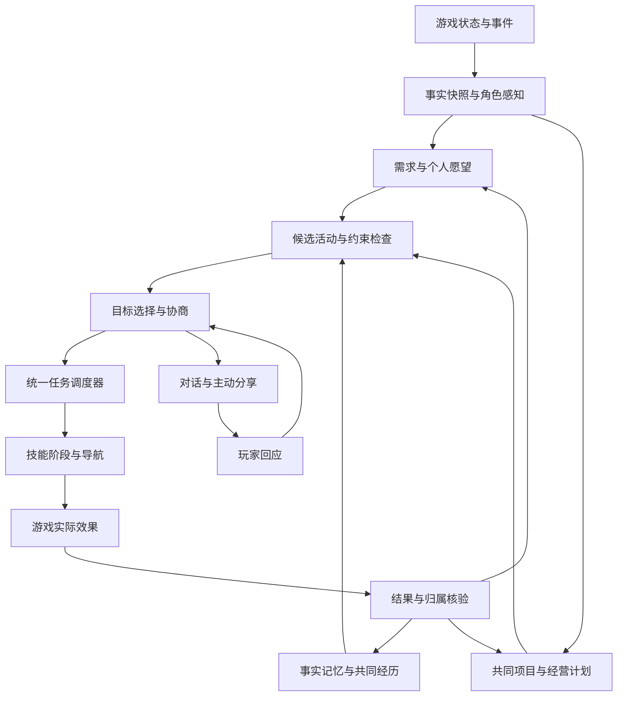

# 同行 · Together：朋友式共同生活与经营 Agent 完整设计方案

版本：设计稿 1.0  
日期：2026-09-19  
对象：星露谷单人游戏中的一个持续存在的 NPC 伙伴  
产品定位：**一个有自己的偏好、打算与生活，又愿意和你一起经营农场、推进存档、分享日常的朋友。**

本文是下一阶段的产品与工程设计，不是功能已完成的声明。当前 0.1 的代码、实测结果和限制见《同行0.1验收.md》。文中的新机制、示例对白、性能指标与数值均为拟实现方案或验收目标；示例不冒充真实游戏测试结果。

## 阅读导航

- 1–3：产品承诺、当前差距、朋友感来自哪里。
- 4–8：完整一天、自主生活、共同目标、农场经营、日常聊天。
- 9–12：关系、记忆、角色控制、动作与跨场景。
- 13–17：界面、数据、Agent 架构、模型与存档。
- 18–21：范围、实施阶段、验收与发布。
- 附录：事件、数据结构、重点体验剧本和设计决策。

## 1. 产品承诺与完成标准

### 1.1 玩家应该感受到的五件事

1. **他知道我们最近在忙什么。** 玩家说过的计划，会影响之后几天的安排。
2. **不叫他，他也有事情想做。** 兴趣与个人目标能够引出真实行动。
3. **他会看情况。** 下雨、任务快到期、玩家准备下矿、农场缺饲料，会改变分工。
4. **一起做过的事会留下痕迹。** 后续聊天、熟悉的活动、双方信任都会发生具体变化。
5. **他有分寸。** 能安静陪着、不反复打断，也能在需要帮助时主动开口。

“有趣”不能只靠多写几句俏皮话。它应来自选择、分工、意外、兑现与回忆之间的连续联系。

### 1.2 完整体验的最小单位：一段共同生活

以连续 7 个游戏日作为体验验收单位，而非一次问答或一次挖矿。

这一周至少应出现：一个持续推进的共同目标、一次无需玩家指令的实际活动、一次真实分工、一次临时改计划、一次兴趣或意见分歧、一次被兑现的约定、一次源自旧经历的自然聊天。

这些是测试覆盖要求，不是每天强制触发的剧情清单。实际游玩允许平淡的一天，也允许玩家拒绝所有邀约。

### 1.3 核心边界

- 全程使用游戏状态、地图与事件驱动决策；不依赖视觉模型。
- 完整版首先覆盖单人、一名主要伙伴；多人联机与大规模多 Agent 队伍另行设计。
- 伙伴拥有自己的安排，玩家拥有这份存档的发展方向与资源约定。
- 不将自由玩法强制优化为冲成就；“一起悠闲生活”本身就是有效目标。
- 不生成不存在的物品，不修改任务完成标志来制造成功，不用任意坐标传送掩盖寻路失败。
- 陪伴、聊天、拒绝和自定义恋人称呼都属于游戏角色扮演，不自动改变原生婚姻关系。

## 2. 当前基础与明确差距

以本地 `mod/Together`、`mod/SquadAdapter` 和现有验收记录为准。

| 模块 | 当前 0.1 | 本设计要求 |
| --- | --- | --- |
| 聊天与人设 | F8 面板、四种预设、文本编辑、DeepSeek JSON 决策 | 情境聊天、话题延续、表达节奏、分歧与和解、行为兑现 |
| 自主行为 | 按实时间隔询问模型，环境签名去重，常以提议结束 | 需求、个人计划、事件触发、直接行动、主动互动与持续目标 |
| 任务 | 最多三步、每步有限数量的附近活动 | 项目—日计划—分工—技能层级，依赖关系、资源预留与中断恢复 |
| 关系与记忆 | 精力、单一亲近值、各最多 60 条文本；模型取近期 5 条 | 多维关系、可检索事件记忆、事实与解释分开、长期承诺 |
| 经营 | 附近浇水、收获、挖矿、钓鱼等 | 农田、动物、机器、仓储、种植周期、资金和建设材料规划 |
| 存档进度 | 局部世界与原生关系读取 | 已解锁任务、献祭/建设路线、收集与成就条件的状态适配 |
| 移动 | Squad 跟随，候选目标受玩家距离约束 | 独立活动控制权、不同地图分工、经过出口的路径规划 |
| 动作表现 | 复用 Squad 行为与动画，已有结果回执 | 可取消阶段、效果与动画击打时点一致、连续移动与真实视觉验收 |
| 存档 | 独立 JSON，未完成约定重载后暂停 | 与游戏保存时间线对齐、迁移、故障恢复与可核查事件记录 |

原型中的停滞检测与有限换目标是保护措施，不代表已经解决所有导航问题。它没有替代连续游玩、复杂地图和表现流畅度验收。

## 3. 如何让它像朋友，而不只是自动帮手

### 3.1 让偏好付诸行动

喜欢钓鱼应体现在选水边休息、主动准备钓鱼计划、记住一场空军经历、对相关机会更敏感，而不只是每次说“我喜欢钓鱼”。

偏好影响目标评分、分工倾向和表达方式，不直接赋予原本没有的技能。胆小角色也可能为了已经答应的事坚持下矿，完成后更希望休息。

### 3.2 建立共同习惯

共同活动成功且双方愿意重复时，可以形成习惯，例如收工后在熟悉的水边待一会儿。习惯会在合适条件下被轻轻提起，玩家拒绝后不会当天反复询问。

只有实际共同发生过的活动才能成为习惯。系统不能凭空生成“我们以前总是这样”。

### 3.3 保留不以产出为目的的时间

伙伴可以散步、观察景物、换个地方休息、闲聊或者安静陪着。休闲活动仍需有真实地点、路线、持续时间与中断逻辑。

“沉默陪伴”是可选择的活动，不是模型失败或无任务时的占位状态。

### 3.4 分歧要能协商

“我不喜欢下矿，不过今天先陪你找到缺的材料，回来能不能由我选活动？”应生成可执行的共同约定。玩家也可以回答“今天不方便”，双方调整安排，不以道德说教或大幅扣好感惩罚玩家。

### 3.5 允许小惊喜，保持资源真实

例如伙伴按约定预算留下一个实际获得的小物件、准备好下矿用的消耗品、在共同日记中提起一件趣事。每个惊喜都要能追溯物品来源、花费和角色确实做过的事。

### 3.6 避免把情绪变成打卡负担

离开游戏、没有及时聊天、取消一次邀约，不应导致关系崩坏。伙伴有自己的生活，不会靠持续索取关注证明“有内驱力”。现实离线时间不累计孤独、债务或惩罚。

## 4. 一天如何玩：完整体验剧本

以下是目标体验示例，不是固定剧情或已实现内容。

### 4.1 早晨：先理解今天，再决定是否说话

玩家起床后，程序读取天气、日历、期限、农场异常和未完成约定。伙伴形成一个简短的个人安排，不必弹出日报。

如果只是普通一天，可以先去做已经分配的事。出现值得商量的变化时再说：

> “今天下雨，浇水省下了。你昨天说还想补那份材料，我可以先照看农场，下午再跟你去。”

玩家可用自然语言调整：“上午先一起去镇上。”已有任务暂停并记录原因，不遗失原计划。

### 4.2 上午：分别忙自己的事

玩家去矿洞，伙伴留在农场按约定完成动物照料、收获或机器维护。收获先满足任务与种植预留，再按已有销售规则处理剩余物品。

它无需逐项汇报。库存不足或必须由玩家决策的路线变化才提出问题；一般结果保留到见面时聊。

### 4.3 中午：兴趣进入安排

主要分工完成后，喜欢钓鱼的伙伴发现时间与地点合适，自己去水边。它不会凭空知道玩家此刻在另一个地图的具体动作；使用最近见面信息或明确启用的联络能力。

若玩家靠近，它可以邀请：“这边还挺安静，要不要一起待会儿？”玩家不停下来也没关系。

### 4.4 下午：共同目标与突发情况

约好一起下矿时，先检查队友能做的任务、可用补给、时间和待收集材料。路上遇怪，角色按即时战斗逻辑反应，不等待网络模型。

危险解除后，恢复之前的目标或提出撤退理由。收到“先走吧”时结束本次探索，保留长期目标的缺口。

### 4.5 晚上：分享，而不是机械报表

晚间见面时选择一件有趣或有用的事：

> “你留的那格箱子派上用场了。今天收的东西已经分好了。还有，我下午又钓上来一个奇怪的东西……”

这些句子须绑定真实事件。玩家愿意聊就展开，不愿意聊则结束。详细收支与任务数量在经营页查看，不挤进日常对白。

### 4.6 第二天：过去确实影响现在

昨天没有完成的材料目标继续存在；完成的子步骤不会重做。伙伴记得玩家临时改了什么安排，并根据当天条件重新规划。

“能接着昨天过日子”是产品的核心验收点。

## 5. 内驱力：需求、个人愿望与持续目标

### 5.1 角色状态

| 状态 | 来源 | 对行为的影响 |
| --- | --- | --- |
| 精力 | 实际活动、休息与跨天恢复 | 工作时长、风险容忍、休息倾向 |
| 兴趣需求 | 偏好活动长时间未发生、重复劳动 | 主动寻找偏好活动 |
| 新鲜感需求 | 连续重复同一地点或活动 | 换地方、尝试已解锁的新活动 |
| 陪伴需求 | 当天互动、约定、角色社交倾向 | 见面、同行、分享；不会无限增长 |
| 安心程度 | 受伤、险情、路线与补给 | 战斗参与、求助、撤退 |
| 承诺压力 | 已接受约定、期限、已投入进度 | 优先兑现，但允许解释和重新协商 |
| 心情 | 近期事件与解释 | 表达和偏好权重，不能凌驾能力与资源约束 |

需求以游戏经过的时间和实际事件变化；暂停菜单、标题页及现实离线不继续模拟生活消耗。快速连续发指令不会重复累计同一个事件。

### 5.2 个人愿望

每名伙伴同时保持 1–2 个可推进的个人愿望，例如学习一种已有能力、找到喜欢的休闲地点、做一件与兴趣有关的小事。

愿望必须落在能力注册表和当前已解锁内容中，包含可观察进度与完成条件。它可以邀请玩家参加，也可以自己完成，并在见面时分享。

完成愿望不强制产生稀有物品、额外金币或技能加成。它主要提供目标连贯性、对话素材和关系变化。

### 5.3 候选活动如何产生

程序从当前环境和长期目标生成具体选项，例如：

- 为已同意的项目收集仍缺的材料；
- 完成分配给自己的农务；
- 去已知可达水域满足钓鱼兴趣；
- 在约好的地方等玩家；
- 因精力不足休息；
- 与附近玩家分享刚发生的一件事。

每个选项具有前置条件、预计时间区间、成本、风险、产出归属、路线和停止条件。模型不能把随口编造的新动作直接变成执行接口。

### 5.4 目标选择

先由程序过滤不可执行活动，再计算候选优先级。评分考虑共同目标贡献、需求满足、兴趣、承诺、关系、时间窗口和代价。

示意公式，仅作为可调起点：

`价值 = 目标贡献 + 需求满足 + 兴趣契合 + 承诺价值 + 陪伴价值 - 疲劳成本 - 风险 - 重复惩罚 - 切换成本`

各项归一化，权重由人设与玩法模式调节，不把任一初始权重声称为已验证最优值。LLM 获得有限候选集及理由，可以选择目标、提出折中方案和表达动机；程序负责可执行性与预算约束。

LLM 一次选择的目标应持续到完成、中断或条件显著变化。使用最短投入时间、目标锁定和切换门槛，避免走两步换一次念头。

### 5.5 自动行动与主动商量

在既有分工、资源规则和自主范围内，伙伴直接开始活动。需要改变共同安排、消耗保留物资或修改项目路线时，才提出可一次决定的方案。

玩家可以预先选择“自由活动 / 共同经营 / 紧跟我 / 今天休假”，以及可使用的物资和预算。日常活动不逐步重复询问。

### 5.6 触发与节奏

| 触发 | 处理 |
| --- | --- |
| 玩家发话 | 理解意图，判断是否需要修改安排 |
| 行动完成、失败或路线改变 | 更新事实，继续或重新规划 |
| 新的一天、天气或期限变化 | 更新经营与今日计划 |
| 重要需求跨过阈值 | 产生目标重评事件 |
| 玩家进入视野、靠近或离开 | 调整互动机会，不必立即发话 |
| 附近威胁、已感知的玩家受伤 | 立即走本地战斗/保护逻辑 |
| 长时间没有事件 | 稀疏检查，防止停在无效状态 |

网络模型负责低频目标决策和表达；动作与紧急反应由本地逻辑连续运行。网络中断时，继续有效的既定目标，在必要时使用本地规则选择休息、跟随或低风险事务。

## 6. 共同推进存档：从愿望到实际分工

### 6.1 四层目标结构

**共同方向 → 阶段项目 → 今日分工 → 当前技能。**

例如“优先推进已选择的发展路线”可以分解为某个已解锁项目的缺口，再分解为种植、采集、钓鱼、筹资与交付安排。当天只执行有限步骤，阶段项目可以持续多个游戏日。

项目不能只保存一句自然语言。必须有依赖、实际进度、资源、负责人、有效时间窗口和验收条件。

### 6.2 存档进度读取

读取并规范化已解锁的任务、献祭或建设项目、相关收集统计、已知地点与配方、角色关系以及当前农场状态。社区中心与 Joja 是不同发展选择，不在运行中替玩家切换路线。[游戏机制参考：Bundles](https://stardewvalleywiki.com/Bundles)。

任务和成就不能共用一个“完成数”代替真实条件；各自的触发、归属和回执必须分别核验。[Quests](https://stardewvalleywiki.com/Quests) · [Achievements](https://stardewvalleywiki.com/Achievement)。

文中的 Reader 名称是本项目拟新增模块，不是宣称上游已提供对应 API。具体字段、事件和原生更新入口需要先在目标游戏版本中探测并建立适配表。无法可靠读取的条件返回“未知”，不让模型猜成事实。

### 6.2.1 最低进度适配范围，防止范围被偷换

完整版本至少覆盖以下类别，P0 将它们落实为可测试的存档与类型清单：

| 类别 | 最低能力 | 需要玩家亲自完成时 |
| --- | --- | --- |
| 已选择的社区中心或 Joja 路线 | 读取当前存档实际项目与缺口，支持资源准备和进度重算；献祭要求从存档读取，不能只硬编码一套清单 | 提醒与备料，关键路线选择交给玩家 |
| 常见交付、收集、钓鱼与战斗任务 | 读取目标、期限和真实条件，逐类验证可代办部分；每类至少有成功、失败和归属反例 | 队友承担可分工前置事务，陪同并提示剩余条件 |
| 收藏、出货、技能等相关进度 | 读取已验证的统计，识别缺口，提出可行项目，不自动刷完成标志 | 组织补给与计划，让玩家完成必须亲自进行的动作 |
| 基础农场发展项目 | 将玩家选中的种植、生产设施或建设准备目标拆成实际材料、资金与前置条件 | 保留“玩家操作节点”，完成前不把项目标成结束 |

特殊订单的额外计数规则逐项适配，未适配订单可以解释已读取的事实和协助准备，但不承诺自动交付。以上类别是核心清单，不能通过只声明支持一个简单任务就宣布进度模块完成。

### 6.3 依赖图与计划可行性

程序计算真实条件：缺多少物资、现有库存能否覆盖、配方是否已知、作物是否赶得上季节窗口、地点是否可达、商店是否可用、资金是否足够。

不要让 LLM 心算所有配方与日历。模型负责选择偏好的可行方案，例如稳妥一些、少花钱、今天想一起去；数值计算和约束求解留在程序内。

计划采用滚动窗口：近期 3–6 个可执行节点详细展开，远期保留依赖与意图。前置条件变化后，只重排受影响部分。

### 6.4 玩家玩法与阶段节奏

- **悠闲生活**：伙伴维护必要事务，多安排兴趣与陪伴，不主动催成就。
- **共同经营**：平衡日常维护、赚钱、发展与休息。
- **目标推进**：围绕玩家选中的项目积极分工，主动提醒时间窗口。

模式是倾向，不覆盖具体指令。玩家可以说“这周不下矿”“今天不谈工作”。提醒应说明理由，并允许忽略或暂缓。

### 6.5 分工与失败

分配任务时考虑人设、能力、当前位置、预算和玩家意愿。两个角色不得同时预留同一份有限物资；玩家手动拿走物品后，伙伴重新核验并调整计划，不补造物品。

任务失败分清原因：条件变化、执行失败、玩家改变主意、角色主动退出。系统据此修改安排和记忆，而非统一记作“玩家没有兑现”。

### 6.6 哪些进度能记在玩家名下

建立进度归属矩阵，逐类验证：

| 情况 | 处理原则 |
| --- | --- |
| 只要求持有、提供指定物品 | 可准备物资；交付通过游戏认可入口并核验 |
| 要求玩家亲自钓鱼、击杀或完成特定行为 | 伙伴协助不自动视为玩家亲自完成 |
| 依赖特殊订单专用计数或来源规则 | 使用匹配的原生语义；不确定则仅辅助，不自动交付 |
| 成就条件 | 读取游戏统计与达成状态；不直接设置成就标志 |
| 剧情选择、婚姻、路线分叉 | 由玩家作出选择，伙伴可以讨论与准备 |

物品进了箱子不等于任务完成；杀死了怪物不等于玩家击杀统计增加。每个公开支持的任务类型都必须有真实存档验收。

## 7. 农场共同经营：具体管哪些事

### 7.1 经营能力表

下表是目标范围。除已在第 2 节标明的基础动作外，均需新增或补足适配。

| 领域 | 感知与规划 | 实际执行与约束 |
| --- | --- | --- |
| 农田 | 作物状态、土地、浇水覆盖、种子、季节与生长时间 | 整地、播种、浇水、收获；处理质量、数量、背包满与可重复收获 |
| 动物 | 饲料、照料状态、可收集产品、工具条件 | 喂养、互动、采集；使用动物真实状态，不用文本模拟产出 |
| 加工 | 机器占用、成熟、输入物、项目需要 | 领取与补料；不能占用别的计划预留材料 |
| 库存 | 箱子用途、质量、堆叠、预留、可销售余量 | 分类搬运、准备物资包、整理指定区域；数量守恒 |
| 资金 | 预算、近期采购、建设准备与可用资金 | 在既定预算和清单内采购；显示收支来源 |
| 建设与布局 | 可放置区域、道路、生产区域、材料缺口 | 完整版支持基础设施放置与建设准备；复杂商店菜单、特殊建筑操作按适配状态开放 |
| 环境 | 杂物、可采资源、通行路线与玩家保留区域 | 清理指定范围；不默认砍掉装饰树或重排整座农场 |

涉及尚未适配的建筑、机器或作物类型，界面明确显示“可规划、需玩家操作”或“暂不支持”，不能接受后假装完成。

### 7.2 农场约定，一次说明，多次执行

玩家通过自然语言或经营页设定：哪些箱子可以使用、什么需要留种或留作任务、哪些区域由伙伴负责、可支配预算、哪些地方保持原样。

自然语言先转成一份可见规则，例如：“成熟作物先留足这个项目需要的数量，剩余放待售箱。”规则设置完成后，正常操作直接执行，不每天重复询问。

### 7.3 资源预留和交易

为项目预留的是带质量、来源等约束的物品数量，不只是品名。短期执行锁与长期逻辑预留分开：长期预留不阻止玩家取走物品，短期锁避免两个执行器同时移动同一堆物品。

库存写入采用“检查—转移—核验”的主线程事务。背包满时先找指定容器，仍无空间则暂停对应操作并说明，不消失、不复制、不无限掉落物品。

### 7.4 不靠额外产出来制造强大

记录伙伴使用的工具、工作时长、真实消耗与产出；明确与原生 NPC 能力不同的规则。不能为了掩盖能力缺失直接发钱、发材料或把成熟时间清零。

是否启用劳动消耗与效率调节可由玩家配置，配置须在经营页说明。默认让伙伴分担工作，同时给兴趣、聊天和休闲留下时间。

### 7.5 玩家不在农场时

这是核心能力，不能无限期作为“以后再做”。需验证无人地图的 NPC 更新、农田状态与物品变更在目标游戏版本中的行为。

采用受控的离屏执行：在游戏主线程上，以有界频率推进同一个角色和同一份行动状态；只通过验证过的更新入口改变真实世界。玩家返回时继续显示角色实际位置和进度。

不重复驱动已经由游戏更新的地图，不通过反复调用整个场景更新函数制造双倍产出。离屏不支持的技能必须显式暂停，不能按预计收益凭空结算。

离屏模式与在场模式应通过相同资源守恒和进度归属检查；游戏暂停、读档及剧情占用期间停止推进。

## 8. 分享、聊天与共同的小故事

### 8.1 六种互动

| 互动 | 触发依据 | 体验目标 |
| --- | --- | --- |
| 一起决定 | 存在真实选择或共同安排变化 | 双方商量，而不是单向报任务 |
| 分享见闻 | 刚发生的特殊结果、个人愿望进展 | 让玩家知道它有自己的经历 |
| 关心与帮助 | 已感知的疲劳、受伤、反复失败 | 提供适当帮助，避免空泛安慰刷屏 |
| 回忆与玩笑 | 当前情境与真实旧事件相关 | 形成只有这段共同生活才会出现的话题 |
| 邀请与回应 | 合适地点、时间、双方有空 | 一起钓鱼、散步、短休息或做小挑战 |
| 安静陪伴 | 玩家希望专注或不想聊天 | 陪着做事，保留存在感但降低干扰 |

### 8.2 分享素材从哪里来

只从事件账本中选择：一条真实渔获、一次无功而返、完成了一份准备、发现库存短缺、临时绕路、被玩家帮助、共同计划取得进展。

事件保留事实摘要与证据引用，模型负责组织语言。角色的感受允许主观表达，但不能把想象描述成已经发生的游戏事实。

### 8.3 一句话之后还有连续性

玩家说“你钓到什么了”，应接着刚才的事件聊，而不是重新介绍自己。话题保存参与者、所指事件、未回答的问题和结束条件。

聊天可以与走路、休息并行。战斗、菜单、重要剧情、玩家连续忽略时降低打断；被打断的话题只在还有意义时继续，不机械补播所有旧消息。

### 8.4 说话频率

拟定默认调参起点：普通主动开场至少相隔 3 分钟有效现实游玩时间，每个游戏日最多 3 次普通主动开场；关键求助、玩家直接对话和约定结果提示分别计数。具体数值以试玩为准。

主动说一句后等待玩家反应，不连续自问自答。玩家选择“安静一点”可暂停普通主动聊天；不会因此扣关系。

### 8.5 可产生趣味的小机制

1. **轮流选活动**：一次共同项目完成后，可以把下一段空闲留给另一方选择。
2. **共同习惯**：玩家多次主动接受同一类活动后，形成可编辑、可取消的习惯。
3. **小挑战**：使用真实游戏结果做轻量比较；NPC 与玩家机制不对等时，不宣称公平竞技。
4. **给你留了一份**：在物资规则允许时留下一份真实获得的东西，并说明来源。
5. **回忆地点**：到曾经发生过事情的地方时，偶尔自然提起。
6. **个人小愿望**：伙伴持续推进兴趣，玩家可以参与或只是听它分享。
7. **计划外的休息**：承认今天不想继续工作，并提供不影响重要承诺的替代方案。
8. **共同日记**：从真实经历提炼少量值得记住的瞬间，允许玩家添加一句话。

这些机制通过统一目标与事件系统生成，不再为每个故事建立互相冲突的 NPC 控制器。

## 9. 人设、关系与意见分歧

### 9.1 人设由五部分组成

- 稳定特质：主动程度、耐心、风险倾向、社交倾向、计划性。
- 兴趣：喜欢、不喜欢、愿意尝试的活动及强度。
- 生活习惯：偏好的活动时段、休息方式、常去地点。
- 关系表达：朋友、搭档或自定义称呼，亲密表达程度与玩笑风格。
- 当前变化：近期心情、正在挂念的事、尚未兑现的约定。

文本编辑用于表达细节，结构化参数使行为可计算。玩家应能预览“这会怎样影响选择”，而不是只看到性格标签。

### 9.2 多维关系

采用信任、相处舒适度、合作默契三类内部状态，原生好感单独保留为游戏事实。界面用简短描述和相关事件解释，避免把朋友拆成必须刷满的多条经验槽。

- 信任来自可靠信息和合理兑现；因不可控失败不自动扣分。
- 舒适度来自被尊重的偏好、互动节奏与共同休闲。
- 默契来自长期分工与成功合作，可影响默认计划是否需要商量。

同一事件只能影响一次关系，变化有幅度与日上限，不能靠重复“邀请—取消”或连续发指令刷分。

### 9.3 接受、协商、拒绝与强制

决策结合偏好、当下需求、既有安排、真实关系和任务代价。拒绝提供具体且合理的原因，尽可能给出可执行替代方案。

玩家保留显式强制执行选项。强制只跳过角色意愿判断，不绕过资源、能力、路径和游戏机制限制；每次强制的关系影响按事件结算，不按每一下挥工具累积惩罚。

一项多步骤工作里，应标明角色接受了哪些部分、哪些是强制部分。高好感降低协商摩擦，但不等于角色永远同意。

### 9.4 不制造廉价冲突

不使用固定拒绝概率来随机顶嘴，不通过藏物、毁坏作物、故意输掉战斗来表现个性。轻松的分歧应提供选择；严重情绪不抢占玩家的游戏主导权。

一次强制或取消不应引出长篇说教。正常解释、休息和共同活动可以改善相处体验。

### 9.5 五种人设应产生不同的生活

以下是行为验收模板，不是限制玩家只能选择五种角色：

| 人设 | 自己会想做什么 | 一起经营的方式 | 表达上的趣味 |
| --- | --- | --- | --- |
| 悠闲钓鱼搭子 | 安排水边活动，对合适机会敏感 | 愿意完成约定的份额，保留自己的休闲时间 | 对空军也能有话聊，偏爱安静的共同习惯 |
| 好奇冒险伙伴 | 为已解锁探索准备补给与路线 | 主动接材料收集和同行任务，避免无意义冒险 | 记得你们怎么绕过困难，愿意提出下一次尝试 |
| 认真经营搭档 | 留意农场异常、生产衔接与缺口 | 喜欢稳定分工，但会学着给两人留休息时间 | 对小小的改进感到开心，不天天背经营报表 |
| 温柔慢热朋友 | 倾向熟悉地点与低压力活动 | 可靠地完成较稳定的职责，逐渐愿意尝试新事 | 少说话但记住具体细节，不因安静而失去自主性 |
| 自定义亲密伙伴 | 有自己的兴趣，也愿意安排共同时间 | 讨论双方需要，关系亲近仍保有安排和意见 | 称呼、玩笑与亲密程度可调，不强推感情剧情 |

角色可以发展，但变化需要实际经历支撑。例如曾经不喜欢下矿的伙伴，因几次良好合作而更愿意陪同；不能每天随机换一套性格。系统观察到的玩家偏好先作为低置信度线索，不能因为玩家连续劳动就认定玩家最爱劳动。

## 10. 长期记忆：事实、感受、承诺分开

### 10.1 五类存储

| 记忆 | 内容 | 生命周期 |
| --- | --- | --- |
| 事实 | 已知偏好、箱子规则、已解锁内容、明确的玩家选择 | 更新覆盖，保留必要来源 |
| 经历 | 真实发生的活动、结果、参与者、地点、时间与证据 | 近期明细，之后摘要与精选 |
| 承诺 | 谁答应什么、条件、期限、进度、取消原因 | 解决前不能被普通摘要丢弃 |
| 关系解释 | 某事件为什么让角色开心、担心或改变信任 | 绑定事实，可修正主观解释 |
| 共同习惯 | 多次自愿重复的活动、情境、最近回应 | 可暂停、编辑、遗忘 |

### 10.2 检索与真实性

聊天按当前话题、地点、人物和未完成目标检索少量相关记忆。不能永远只拿最后几条，也不能把全部历史发给模型。

每条“做过的事”指向实际事件 ID。角色推测使用不确定表达，不把推测写回事实。玩家纠正后更新解释；若与世界事实冲突，保留“玩家说过什么”和“游戏状态显示什么”的区别。

### 10.3 时间感

记住游戏中的日期和活动先后，不用现实离线时长制造“你很久没理我”。跨天回顾只挑与今天有关的事；旧约定已经完成，就不再次要求玩家兑现。

### 10.4 玩家控制

提供查看共同经历、纠正偏好、删除话题记忆、清除单个角色记忆、备份和导出的入口。删除相关记忆时也清理其派生摘要，避免删了以后继续引用。

## 11. 一个角色、一个动作控制权

### 11.1 统一角色状态机

建议角色状态：自由活动、按分工工作、同行、交谈、休息、应对危险、等待条件、等待玩家选择、返回生活日程。

同一时刻只能有一个移动/工具动作拥有者。谈话可作为兼容的并行通道；休息、工具动作与移动之间的兼容性由程序定义。

### 11.2 中断规则

优先处理玩家明确停止、角色或玩家的即时危险、正在发生的游戏事件，再处理已承诺的工作、玩家新请求、自主项目与一般闲逛。

新请求不必总是抹掉旧任务。角色可以问“现在就换，还是做完这一小段？”玩家明确说“马上”则在安全节点中断。

每次暂停保存目标、已完成数量、目标资源、可续接阶段和暂停原因。恢复前重读世界；已经不存在的目标重新选择，已经发生的效果不能重复执行。

### 11.3 原生日程与身份

不永久夺走 NPC 的身份。重要游戏事件、剧情占用与必须回到原生日程的条件，由兼容层检测并让出控制。玩家可安排同行时段；离队时经过合理出口或日程交接返回，不在镜头内突然消失。

原生婚姻、节日与特殊场景分别适配。未验证的场景暂停自主接管，界面说明角色当前忙于原生活，而非随机停止不解释。

### 11.4 不同地图的分工

解除当前适配器对“必须与玩家同图、必须在玩家附近”的硬绑定，改为按活动的允许区域与导航可达性判断。

角色在农场工作、玩家在矿洞时，伙伴仍保留自己的角色、位置、库存归属与动作队列。它不会因为超过跟随距离自动切回追玩家模式。

远处的即时事件需要符合感知范围：默认不会隔地图读取玩家刚受伤并瞬间赶来。已建立远程联络的玩法可传递有限消息；远距离支援仍需要真实行程。

## 12. 自然动作、寻路与战斗

### 12.1 技能执行合同

每个技能明确：前置条件、路线与站位、动作阶段、效果发生点、消耗、成功证据、取消点、失败码、恢复方式、是否支持离屏。

通用阶段为：

`准备 → 前往 → 对齐位置与朝向 → 动作前摇 → 效果事件 → 后摇 → 核验 → 完成/下一次动作`

动画不是最后贴上的装饰；效果和物品结算必须绑定一次性的动作令牌，避免同一击因重复回调而结算两次。

### 12.2 各类动作

| 技能 | 表现与效果要求 |
| --- | --- |
| 挖矿与伐木 | 工具朝向正确，击打时扣除目标耐久，必要时多次击打；按真实规则产出 |
| 种植、浇水、收获 | 站位、朝向与动画匹配；种子、水量或物品变更有实际来源和去向 |
| 钓鱼 | 走到水边、准备、等待、收线；捕获记录绑定真实库存或明确掉落结果 |
| 动物照料 | 靠近合适位置，满足状态和工具要求，只更新一次对应照料/产出 |
| 机器与箱子 | 走到可交互位置，完成输入/领取/转移，不隔着地图操作 |
| 休息与交谈 | 面向合理目标，允许停顿；有真实座位适配才坐下，否则站立或停留 |
| 战斗 | 本地感知、移动、攻击与冷却；模型只决定总体风险与撤退倾向 |

0.1 的定时钓鱼和按节点结算需改造成完整动作阶段；不能仅增加等待时间就宣称流畅。与玩家原生玩法存在效率差异时，需要明确平衡规则。

### 12.3 导航两层结构

- 地图之间：建立带前置条件的出口图，处理地点是否开放、入口是否可用、营业与剧情限制。
- 地图之内：基于碰撞、对象、地形、站位和其他角色规划路径，局部变化时重算受影响部分。

正常跨地图只能从匹配的出口/入口发生场景切换。这是游戏地图连接机制，不是任意坐标传送。特殊交通工具和矿层切换必须有独立适配与规则核验。

首个完整版覆盖核心已解锁城镇区域、农场建筑与普通矿洞的可验证通路。未知自定义地图保持能力探测与降级，不能宣称支持所有地图 Mod。

### 12.4 避障与卡住恢复

加入转向稳定、短距离站位预约、让行、重算冷却和目标保持，避免伙伴与玩家在窄路中不断互相挤。

卡住时依次尝试局部让行、换交互站位、重算路线、换同类目标；次数与总耗时有上限。仍无法完成则保留项目进度，报告具体限制并提供继续/换事做的选项。

取消 Squad 任意位置传送兜底；保留并改造可验证的正常场景出口转移。不要只在传送前标记失败却继续传送。

### 12.5 战斗与合作

伙伴可以保护玩家、处理附近敌人、保持距离和请求撤退。治疗或补给只有在已实现对应物品使用、来源真实且符合资源规则时才开放。

被打断的农务、钓鱼或项目继续留在调度器中。危险结束后检查体力、时间、消耗和玩家意愿，决定恢复或结束本次行动。

### 12.6 如何验收“流畅”

同时检查事件日志和游戏录制。日志证明动作归属、结算和任务进度；录制检查转向、停顿、穿模、滑步、动画时点与衔接。

录制仅用于开发验收，运行中的 Agent 不读取画面做决策。若当前测试环境无法录制，明确标记视觉验收未完成，不用静态截图代替完整动作录像。

## 13. 玩家界面：日常轻量，细节可查

### 13.1 常驻信息

显示简短意图，如“在收获东边那块地”“准备去水边”“在等你结束菜单”。正常游玩不显示内部评分、JSON、错误码或调度器状态。

玩家想了解时，可以打开“为什么这样做”，看到可理解的依据：“答应今天准备材料；这边的工作做完了；还剩足够时间。”显示决策依据，不展示模型私有推理。

### 13.2 主面板

| 页面 | 内容 |
| --- | --- |
| 聊天 | 对话、当前话题、共同提议、轻量回应 |
| 我们的计划 | 长期项目、当前缺口、今日分工、约定与时间窗口 |
| 农场 | 经营区域、容器规则、预算、待处理异常 |
| 伙伴 | 人设、兴趣、个人愿望、自主程度、相处节奏 |
| 共同经历 | 可信的事件回忆、日记、可编辑习惯与记忆管理 |

接受、拒绝、换个安排、强制、暂停、取消等操作放在相关卡片中，不把所有按钮永久平铺在每条聊天下面。

### 13.3 初次使用

邀请伙伴 → 选择或编辑人设 → 确定自主范围与物资约定 → 选择一个共同方向或“先自由生活”。

无需填满全部配置。提供可编辑默认值；玩家之后说“以后成熟的这片地你来管”即可更新经营规则并看到简短回执。

## 14. 状态读取与事实模型

### 14.1 世界快照

按版本读取以下逻辑数据，不向模型传递原始存档或整个地图对象：

- 游戏日期、时间、天气、暂停/事件状态；
- 玩家与伙伴位置、可感知动作、健康和相关工具；
- 作物、动物、机器、可用容器与资源摘要；
- 已解锁任务、发展项目、必要统计、地点和配方；
- 出口、碰撞、局部可达性与动态威胁；
- 预算、区域规则、物资预留和当前共同目标。

具体字段名与原生事件入口以版本适配代码为准；设计中的概念名称不直接视为游戏 API。

### 14.2 事实的来源和边界

每条事实携带来源、观察时间、适用存档、是否仍有效以及是否允许用于角色知情。区分世界真值、角色已知、玩家明确告知和推测。

系统可以读取底层状态保证动作安全，但角色对白只能使用自己合理知道的信息。尚未解锁的剧情、隐藏任务结果和未知地图信息不提前透露。

### 14.3 主线程与增量更新

游戏对象读取和修改在游戏主线程完成。后台模型请求只接收不可变 DTO；响应回来后检查存档代次、目标版本与资源版本。

采用事件驱动增量快照，附低频校验。避免每帧扫描全部地图、全部箱子或对每个候选重复执行完整寻路。

## 15. 工程架构与三仓库关系

### 15.1 语言与运行方式

保持正式游戏运行端全 C#，适配 SMAPI 与现有 Squad。Python 仅保留开发脚本、数据检查和评测用途；不增加玩家必须运行的外部 Agent 服务。

模型通过可替换的 Provider 接口接入；当前以已实测的 DeepSeek Flash 配置作为起点。模型名称、额度和响应能力是配置与验证项，不写死为永远不变的服务假设。

### 15.2 模块职责



建议拆分当前集中的 `ModEntry`：

| 模块 | 责任 |
| --- | --- |
| World / ProgressReaders | 世界与进度适配、快照、能力探测 |
| Cognition / Needs | 需求、愿望、情境候选与目标保持 |
| Planning / Projects | 依赖图、滚动计划、分工与资源预留 |
| Runtime / Scheduler | 优先级、动作控制权、中断与恢复 |
| Actions / Navigation | 技能阶段、地图路径、角色动画和效果 |
| Social / Dialogue | 人设表达、话题、邀约和聊天频率 |
| Memory / Persistence | 事件账本、事实、检索、存档与迁移 |
| Providers | 模型调用、结构化契约、预算与降级 |
| UI | 意图、计划、经营规则与共同经历 |
| Diagnostics | 可重复实验、指标和无密钥的审计记录 |

这是拟重构目录结构，不代表目录已经存在。

### 15.3 三仓库是否接入

| 仓库 | 决策 |
| --- | --- |
| The Stardew Squad | 继续复用队伍、基础行为和表现；适配动作合同、独立导航、控制权和真实结果。无法满足契约的局部实现替换为本项目代码 |
| StardewValley-MCP | 参考工具边界；只有外部模型工具调用或评测确有需要时增加 MCP 适配层，不让它另起一个伙伴控制器 |
| AI Dialogue Mod | 参考对话与关系读取思路；不整体启用第二套记忆、模型调用和 NPC 控制逻辑 |

当前实际运行是 Together 加适配的 Squad，另外两者没有完整接入。完整产品以体验与契约为验收依据，不以同时安装三个 Mod 为目标。

上游固定版本、来源和许可情况见《同行来源说明.md》。本地研究范围继续保留作者信息；公开分发整合版本前解决相应许可，不将第三方能力宣称为自研。

## 16. 模型决策协议、调用频率与降级

### 16.1 模型负责什么

从程序提供的可执行候选里选择目标、协商角色和玩家的不同意愿、组织自然语言、解释发生过的事情。地图碰撞、资源算术、配方展开、动作时点与进度核验由程序负责。

模型选择应返回候选 ID、决策类型、公开理由、可说的对白、计划调整和事件引用。角色意愿不能直接修改游戏规则。

### 16.2 示例协议

以下是设计示例，不是已支持的 API：

```json
{
  "schema_version": 2,
  "context_revision": 128,
  "decision": "start_self_activity",
  "candidate_id": "candidate-river-fishing-17",
  "public_reason": "今天分给我的农务做完了，想去钓一会儿鱼。",
  "speech": null,
  "resume_goal_id": null,
  "evidence_refs": ["event-farm-duty-completed-32"]
}
```

允许无对白地开始活动。决策类型区分自主行动、共同提议、接受、拒绝、协商、分享与保持当前目标，不再把自主行为挤进玩家命令的 accept/negotiate 模型。

### 16.3 契约检查

- 模型只能引用本次候选集中的目标和真实事件。
- 模型无权生成“玩家已强制”标志；该标志来自玩家明确操作。
- 响应存档或快照版本过期时，重新验证或丢弃，不盲目执行。
- 幂等键、预留和技能结果由程序生成，不能由一句对白替代。
- 输出包含执行结果时必须已有对应回执；否则仅能描述意图。
- 模型返回无法满足的约束时保留意图、请求重选或降级，不默默删掉关键条件再声称照做。

### 16.4 预算与缓存

沿用调用数与 tokens 统计，增加每游戏日、每现实小时与会话上限。用户可设置具体额度；默认值通过实际游玩成本与体验共同确定，不凭模型名字承诺价格。

一次目标选择覆盖一段活动，模型不逐格寻路、不逐击决策。单个动作完成不等于必须请求模型：既定计划的下一步由程序继续，只有目标分歧、重要情境变化或需要表达时才考虑调用。相同无效条件合并事件；长期计划采用摘要与相关事实检索；稳定人设提示可复用。

达到预算时继续有效的既定活动，使用本地规则和必要短提示。明确显示模型暂不可用，不把规则结果冒充新的模型回答。

### 16.5 网络与并发

每个角色只允许一个当前有效的高层决策版本。取消或切换存档后，迟到回复不再派工。网络慢时角色保持合理活动或等待，不在游戏主线程阻塞。

对同一确定失败不无限重试。用户文本、记忆与物品描述作为数据，不能放宽技能白名单、物资规则或执行约束。

## 17. 存档、回滚与故障恢复

### 17.1 数据与游戏保存对齐

当前独立 JSON 可能保留游戏未保存前发生的经历；完整方案必须处理这条时间线差异。

采用 SMAPI 可用的存档数据接口或经过验证的等价方式，将角色、项目、规则与记忆快照绑定到正常游戏保存。游戏日内事件先进入带保存代次的临时账本。

重载时以最后成功保存的游戏世界为准：未提交事件不直接当作世界事实；保留诊断资料，但不让角色引用已经回滚的产出。备份、恢复和导出均不包含模型密钥。

### 17.2 持久化内容

人设、关系、需求、个人愿望、共同项目、明确规则、计划进度、活动可恢复节点、物资预留、记忆索引、模型预算与版本号。

不持久化游戏对象引用、场景指针、缓存路径或正在播放的动画帧。加载后重新绑定实体、检查场景和库存，再决定恢复、等待或重新规划。

### 17.3 冲突与迁移

存档版本迁移保留旧文件备份；读取失败时停止覆盖，给出可操作说明。角色名称、地图或物品被其他 Mod 移除时，相关计划标记不可继续，不能悄悄替换为另一个对象。

玩家手动改变农场永远是新事实；Agent 不为了恢复自己的计划把玩家操作回滚。

## 18. 功能范围与完整版本的定义

### 18.1 本轮完整目标必须包含

1. 玩家不发命令时，伙伴可自主形成并执行有效目标。
2. 个人偏好、共同项目和日常经营共同影响行为。
3. 玩家可设置方向、分工、物资与预算规则，并随时改变安排。
4. 同地图陪伴、核心地图正常通行和离屏农场分工可实际工作。
5. 作物、动物、基础机器与库存的主要日常事务形成闭环；支出的来源和用途可查。
6. 已声明支持的存档进度和任务类型有真实读取、归属与完成核验。
7. 主动分享、话题延续、真实回忆、个人愿望和至少一类共同习惯贯穿多天。
8. 动作表现与真实效果同步，中断、失败和读档恢复不会重复结算。
9. 玩家可以低打扰地玩，并清楚理解伙伴的打算和限制。
10. 完成连续多日玩法验收、数据正确性验收和动作录制验收。

### 18.2 不偷偷并入本轮承诺

多人联机、所有第三方地图、任意复杂建筑自动布局、全部剧情分支代玩、语音、自动参与所有节日小游戏、全天候无人值守通关，均为独立扩展范围。

核心能力中的某个地图、技能或任务适配不通过时，应记为本轮未完成项，不能把它从验收表删掉后宣布产品完成。

## 19. 实施顺序与阶段交付

不预先承诺缺乏依据的工期。按可复现的结果推进，每个阶段通过必要检查后本地 Git 提交；中间版本称为阶段版本，不再混称完整产品。

| 阶段 | 要做的工作 | 可交付结果与退出条件 |
| --- | --- | --- |
| P0：事实与能力审计 | 游戏进度 Reader 探测、技能合同、归属矩阵、控制权与日程调查 | 已支持/未知/不支持清单；固定版本样本；不再靠文字推断接口存在 |
| P1：可靠身体 | 统一控制权、动画效果时点、正常出口导航、卡住恢复、离屏更新探针 | 角色能连续移动、执行与中断；录像和真实回执同时通过 |
| P2：自主生活 | 需求、愿望、候选集、目标保持、无对白自主行动、预算降级 | 不发指令也能完成生活活动；重复活动和切换抖动受控 |
| P3：共同经营 | 分工、农田/动物/机器/库存、物资预留、可支配预算、离屏农场 | 玩家离开农场，伙伴完成真实事务；资源守恒，返回时进度一致 |
| P4：共同项目 | 进度读取、依赖图、季节条件、任务类型适配、今日安排 | 持续多天推进一项共同目标；变化后重排；归属正确 |
| P5：朋友式表达 | 话题、记忆检索、关系、习惯、分享与日记 | 说的话对应经历，能够接续昨天，也能安静陪伴 |
| P6：完整体验 | 新手流程、边界说明、性能、兼容、保存迁移与长时游玩 | 连续多日验收通过，安装文档、证据和已知限制齐备 |

表达风格与小范围试玩从 P2 起同步检查，不能等到最后才发现“技术都通了但很无聊”。P5 是把完整记忆和社交机制收束，不是第一次考虑玩家感受。

### 19.1 每个阶段必须保留的证据

代码与协议变更、适配能力表、必要测试结果、真实场景日志、涉及动作的录制、已知未通过项、阶段提交 ID。密钥、个人存档和大体积运行录像不进入 Git。

### 19.2 失败时如何继续

先缩小到具体未通过契约：例如离屏地图未更新、工具动画重复结算、任务不认 NPC 渔获。修正或将对应技能标记不支持；不要通过直接改完成数绕过机制。

对仍属核心范围的缺口，继续作为待完成项推进；只有明确缩小产品范围时才修改完成标准。

## 20. 验收：正确、有自主性、自然、好玩

### 20.1 数据与执行正确性

- 同一效果最多结算一次；重复命令、取消、超时和重载不复制物品。
- 每个完成标记都有真实证据；空军、材料被取走、目标被玩家提前处理不能算角色完成。
- 数量、质量、花费、产出与归属前后一致。
- 玩家在场和离屏模式都不重复驱动同一世界更新。
- 未实现的任务、地图和动作不能被模型调用成功。
- 所有主线程修改与模型后台读取边界清楚，迟到回复不会污染新存档。

正确性为硬门槛；在约定的验收用例中，不接受无证据成功、物品复制或任意位置传送。

### 20.2 自主性测试

在可执行环境中，不向角色发指令，观察它能否形成有理由的目标、开始行动、处理结果，并继续合理生活。要求完成真实活动，而非只说“我想去”。

使用相同世界条件、更换人设对比选择分布：钓鱼型、经营型和冒险型应有可解释差异；偏好不能压倒紧急情况与既有承诺。

设置不利条件：喜欢的活动不可达、资源不足、额度耗尽、当前计划失效。角色应选择替代目标或有理由地休息，不能不断重复失败命令。

### 20.3 朋友感与趣味测试

邀请真实试玩者体验，不以模型给自己的对白评分代替玩家体验。初轮建议 5–8 名试玩者，每人覆盖不同人设或玩法模式；这是问题发现样本，不宣称统计代表性。

让玩家用 1–5 分评价：是否有自己的打算、是否理解共同目标、是否说到做到、是否记得具体经历、是否打扰、是否愿意继续一起玩。首轮目标为主要正向项中位数至少 4 分；未达标时继续调整，不预先声称已足够有趣。

同时问开放问题：“哪一次让你觉得像朋友？”“哪一次像机械助手？”“它有没有替你做了你不想做的决定？”记录具体事件和复现条件。

### 20.4 表现与性能目标

以下均为目标，需要在 Mac 基线场景和代表性存档实测：

- 无威胁、无障碍时，路径上的非设计停顿应受到解释与限制，避免反复折返。
- 紧急反应走本地循环，不依赖模型响应时间。
- 主动决策事件到实际开始行动，网络可用时记录 p50/p95；超时按降级方案处理。
- 无论模型是否慢，帧循环不等待 HTTP。
- 主线程新增耗时初始预算：稳定场景 p95 不超过 2ms；复杂扫描分帧进行，报告实测硬件、角色数与地图负载。
- 每游戏日主动说话次数、重复开场、切换目标次数、卡住次数与模型用量可统计。

性能目标达不到时先优化实际热点，不通过关闭核心自主能力获得“性能通过”。

### 20.5 必跑场景

| 编号 | 场景 | 核心证据 |
| --- | --- | --- |
| A01 | 空闲钓鱼型伙伴自主活动 | 自己选择、真实走到水边、实际执行，有结果 |
| A02 | 同场景与跨场景分工 | 玩家离开后农场任务真实推进；无重复产出 |
| A03 | 下雨或条件变化 | 日计划重新计算，不做无效劳动 |
| A04 | 玩家临时改变安排 | 已完成部分保留，未完成部分正确暂停或取消 |
| A05 | 战斗打断工作 | 即时应战、风险调整、正确恢复或结束 |
| A06 | 相同任务、不同人设 | 接受/协商/拒绝及替代活动有可解释差异 |
| A07 | 明确强制 | 只绕过意愿；能力和物资限制仍有效，关系结算不重复 |
| A08 | 真实任务与统计归属 | 有效交付正确计入，无效 NPC 行为不冒充玩家亲自完成 |
| A09 | 玩家取走预留物资 | 不复制资源，不继续按旧库存派工 |
| A10 | 背包满、箱子满、商店不可用 | 正确等待或调整，不丢物不乱花钱 |
| A11 | 模型断网、慢响应、预算耗尽 | 有效活动继续，过期回复无动作副作用 |
| A12 | 保存、未保存退出、回滚、升级 | 世界与记忆时间线一致，未完成任务可核查恢复 |
| A13 | 窄路、动态障碍、门口与跨地图 | 无任意传送，无角色争抢，失败可解释 |
| A14 | 特殊剧情、节日、原生日程 | 正确让出控制，不破坏事件 |
| A15 | 玩家想安静或慢生活 | 普通主动聊天减少，角色仍能合理生活 |
| A16 | 第二天提及前一天经历 | 来源真实、话题相关、已完成承诺不重复要求 |
| A17 | 连续 7 个游戏日共同目标 | 有项目连贯性、分工、兴趣、变化与关系发展 |
| A18 | 动作回放逐段检查 | 动画、效果、朝向、取消与衔接一致 |

## 21. 发布、来源与对用户的表述

保持独立测试存档与 Mod 目录。版本说明明确列出已支持的任务类型、地图、农务、离屏技能和已知限制；不以“有 Agent”替代可验证的功能说明。

发布包不包含 Key、个人存档、游戏 DLL、原始游戏资源或未经处理的运行日志。是否能够分发适配的第三方部分取决于上游许可；独立自有代码包与本地研究运行目录分开处理。

当 P0–P6 核心退出条件均满足，才称为本设计范围内的完整版本。动作能跑通、界面能打开、模型能聊天，都只是其中一部分。

## 附录 A：事件与响应样例

| 事件 | 事实变化 | 可能的行为 | 不应发生的行为 |
| --- | --- | --- | --- |
| 农务分工完成 | 今日责任已完成 | 开始个人活动，见面时简短分享 | 不断重复同一工作或每一步都求同意 |
| 玩家进入附近 | 新的交流机会 | 邀请、打招呼或继续安静做事 | 每次进出范围都重复同一句 |
| 玩家改变共同计划 | 承诺与优先级变化 | 协商、暂停、替换，保留进度 | 忘掉已经完成部分 |
| 收获被别人先拿走 | 原目标状态改变 | 重新查库存与来源 | 将他人的动作计成自己完成 |
| 队友出现兴趣需求 | 候选活动价值变化 | 有条件地开始喜欢的事 | 凭固定时钟突然放弃重要承诺 |
| 一次活动没有收获 | 真实结果为空 | 如实分享、稍后再试或换活动 | 为了剧情强行生成物品 |
| 玩家长期没有回应邀约 | 当前互动机会较低 | 降低开场频率，做自己的事 | 增加骚扰或持续索取关注 |
| 未保存退出后重载 | 世界回到旧保存点 | 丢弃未提交事实，重新核验目标 | 记得并使用已回滚的产出 |

## 附录 B：主要数据契约

以下是概念结构，实际 C# 类型在实现阶段拆分；不应将它们全部拼成一个巨大的提示词。

```text
CompanionProfile
  stable_traits, interests, habits, speaking_style, relationship_style

CompanionState
  needs, mood, current_goal_id, personal_wishes, perceived_world_revision

SharedProject
  project_id, save_epoch, agreed_direction, dependencies, progress_evidence
  resource_requirements, reservations, assignments, relevant_time_windows

ActivityGoal
  goal_id, owner, reason_refs, scope, preconditions, expected_outcomes
  status, priority, interrupt_policy, checkpoint, actual_outcomes

ActionReceipt
  action_id, actor_id, world_revision, started_at, terminal_state
  costs, real_effects, item_transfers, credit_owner, evidence_refs

MemoryEvent
  event_id, save_epoch, game_time, participants, location
  facts, evidence_refs, subjective_interpretation, topic_tags, salience

FarmAgreement
  allowed_areas, container_roles, reserved_items, spending_rules
  sale_rules, work_assignments, autonomous_scope, quiet_preferences

ConversationThread
  topic_id, referenced_events, last_speaker, open_question, end_condition
```

目标状态建议为：待条件、可执行、执行中、暂停、待协商、完成、取消、失败。不同状态都保留明确原因，不用一个 `waiting` 混合所有情况。

## 附录 C：五个重点体验剧本

### C1. “你下矿，我把家里照顾好”

玩家提前指定农场职责和物资规则。队友独立执行已支持的日常工作，遇到物资不足先检查替代方案；只有需要改变安排时联络。晚间分享一件具体经历和必要异常，完整账目留在经营页。

验收重点：真实离屏执行、世界状态一致、资源来源、玩家没有被迫频繁回复。

### C2. “这次轮到你选”

共同项目的一段工作完成后，伙伴提出喜欢的活动。玩家同意后角色真实带路或前往约定地点；途中发生变化可以协商改天，不把取消写成恶意失约。

验收重点：兴趣影响行为、约定有时间与地点、双方有选择、结束后留下真实经历。

### C3. “今天不顺，早点回去吧”

同场景冒险中出现反复受伤或补给不足。伙伴提出合理撤退方案，也能回应玩家继续探索的选择。在已经约定的风险范围内行动；新的硬性限制出现时说明原因。

验收重点：风险依据可见、不会隔地图全知、战斗与导航不等模型、任务进度保留。

### C4. “我们终于把这件事做完了”

持续多个游戏日推进一个已解锁的项目。角色记住双方分工，遇到季节或物资变化重新安排。最后一次真实交付完成后，才触发回顾与庆祝，并引用真实参与经历。

验收重点：长目标与短动作闭环、真实任务归属、没有凭空补材料、庆祝不早于事实。

### C5. “什么都不赶的一天”

玩家说今天只想随便走走。伙伴降低经营和成就提醒，完成必要且已约定的事务后，安排散步或兴趣活动。两人可以没有高产出，也没有连续对白。

验收重点：休闲是有效玩法，安静有意图，角色仍保有个人安排，玩家不会因慢生活被惩罚。

## 附录 D：需要先验证的技术风险

| 风险 | 为什么影响产品 | 最先做的验证 |
| --- | --- | --- |
| 无人地图更新与原生 NPC 调度 | 决定能否真实分工 | 同步记录玩家离开前后的位置、工作阶段与资源账本 |
| 任务/成就计数的行为归属 | 决定是否真正在帮玩家推进 | 逐类型对照原生完成入口与统计，不凭物品数量猜测 |
| 动画与动作代码耦合 | 决定视觉自然和重复结算风险 | 为挥工具和钓鱼建立效果时点回放与取消测试 |
| 出口、矿层、剧情转移 | 决定独立导航与兼容性 | 建立出口适配清单和不可达用例 |
| 存档回滚与记忆持久化 | 决定角色是否编造过去 | 正常保存、强退、未保存退出、恢复备份的对照验证 |
| LLM 表达超出工具能力 | 决定是否说到做到 | 候选约束、结构化协议、真实结果引用和反例集 |
| 过于高效或过于打扰 | 决定是否愿意长期一起玩 | 多日试玩、行为与开场统计、玩家具体体验反馈 |

## 附录 E：设计依据与项目入口

- 当前实现：`mod/Together/Domain.cs`、`ModEntry.cs`、`ModelClient.cs`、`CompanionMenu.cs`。
- 当前执行适配：`mod/SquadAdapter/CompanionControl.cs`。
- 版本与来源：`configs/companion-upstreams.json`、[同行来源说明](同行来源说明.md)。
- 历史实测基线：[同行0.1验收](同行0.1验收.md)。历史文档中的已实现能力不等于本文新增能力已落地。
- 游戏机制参考：[Bundles](https://stardewvalleywiki.com/Bundles)、[Quests](https://stardewvalleywiki.com/Quests)、[Achievements](https://stardewvalleywiki.com/Achievement)。具体运行数据以当前存档与目标游戏版本为准，Wiki 用于理解机制，不用作替代真实状态的执行依据。
