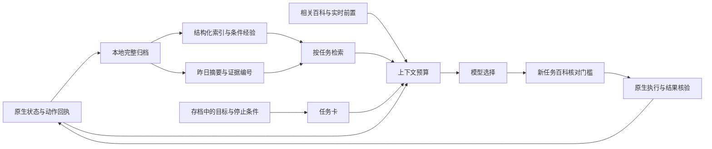

# 记忆重构 V2：实现、取舍与验证

本轮将长期目标、可检索经历、原始证据和本次模型上下文分开。继续使用 C# 与现有 DeepSeek 接口，没有迁移 Agent 框架，也没有引入向量数据库。七天自主经营是后续运行验证，不能由离线测试替代。

## 信息流



## 已实现的模块

| 模块 | 责任与边界 |
| --- | --- |
| `MemoryArchive` | 保留原始事件；派生索引随存档检查点保存，受时间线游标和角色代次限制。旧存档不能读到之后的经历。 |
| `MemoryIndex` | 从动作回执等提取实体、错误、结果和证据编号，最多保留 512 条索引。模型计划不作为事实索引。 |
| `MemoryRetriever` | 实体精确命中、关键词相关度、时间衰减排序；默认只送相关的少量条目。完整历史仍可通过 `memory.search` 和 `memory.evidence` 查询。 |
| `MemoryContextRuntime` | 从已有存档生成任务卡，不另造一套目标真相；组装实时进度、设施候选、百科与任务前置。 |
| `ContextBudget` | 先规则聚合与去重，再按需移出明细；保护目标、计数、背包、菜单令牌和最近观察。关键内容超限则明确报错，不静默截掉。 |
| `MemoryReflectionRuntime` | 有昨日行动证据时，每日最多发起一次可关闭的模型摘要；验证引用的证据属于当前存档时间线。失败保留规则日记。 |

事实优先级：最新原生状态和回执，高于条件仍有效的经验，高于模型生成的摘要与计划。摘要标记为 `model_derived_not_native_state`；引用校验只能确认来源存在，不能证明模型每句话都正确。

## 压缩和检索到底用了什么

1. 行动日记继续使用确定性分组聚合，本轮给模型提供当天活动汇总，避免重复发送大量明细。
2. 检索采用可解释的实体、关键词与时间评分，尚未使用向量相似度或语义重排。
3. 上下文依次经过现有字段裁剪、重复回执清理、旧观察移出、可选明细按需读取；完整原文不删除。
4. 跨日摘要由模型生成，独立计入调用和 token 账本，不每轮重新总结。
5. 请求预算使用 `ceil(UTF8 字节数 / 2)` **估算**，不是模型的准确 tokenizer。通常争取输入估算值不超过 24,000，上限默认 30,000，包含系统提示和工具定义的预留；输出另有限额。服务端真实 usage 才是最终消耗依据。

旧存档可继续加载；旧事件不会一次性全部回填到新索引，历史可用原归档搜索兜底。新索引是有限窗口，并非完整历史数据库。

## 强制查百科的范围

采购、制作、建造、服务、经营任务和发展目标等高层任务，首次提交时先被拦下，程序检索百科、相关记忆和可用依赖，把依据交给模型后再确认执行。同一天、相同任务和容量条件可复用核对；新条件重新核对。连续走路、浇水等低层动作不逐步调用模型。

每次决策带精简的发展视野：稻草人、熔炉、洒水器，以及部分未完成任务、成就和建筑。提示模型每天选择发展目标或说明暂缓原因。配方即使未解锁也能用于规划，执行仍检查原生解锁和材料。

这保证任务前有核对流程，但不保证模型一定选择最优发展路线；全量主线、建筑、工具优先级和长期收益仍需七天行为日志评估。

## 同轮修复

- “继续运行”使用完整存档目标；“新目标”单独操作，避免截断文本导致目标和过夜计数被重新初始化。
- 普通存货允许只存部分堆叠；容量救援仍要求确实腾出空格。保留口粮不再使所有存货都不可行。
- 独立睡觉动作可在非必要收尾失败后执行，真实依赖仍保留。
- 容量、通行等可恢复的连续失败进入任务恢复处理，不直接暂停整个经营；已有有界寻路恢复机制继续工作。不可恢复错误仍暂停，用户暂停不会自动重启。
- 职业选择增加独立菜单通道，在黑屏标志为真时仍能读真实选项、交给模型选择并原生点击；普通升级确认直接由程序完成。职业编号与菜单选项 ID 明确区分。

## 验证与复现

三层证据分别回答不同问题：

1. **域检查**：事实与计划分离、相关性排序、旧存档时间线隔离、遗忘代次、硬预算保留关键状态、摘要假引用拒绝、部分存货及独立睡觉规则。
2. **历史请求回放**：60 个已有请求全部可打包；用户上下文估算量从 1,392,758 降至 645,852，减少 **53.6%**。此比较不包含新增前置核对带来的请求次数，也不是实际账单下降比例。
3. **原生 AgentLab 检查**：新任务百科门槛、完整目标恢复、真实部分堆叠入箱、故障恢复策略、原生职业选择与正常过夜。故障恢复项注入失败回执；职业/入箱/睡眠项使用真实游戏流程。日终摘要检查将本次实际入箱回执放入测试归档，再验证模型摘要和来源校验；它不替代连续运行中的自动采集验证。夹具只可用于专用 AgentLab 测试存档。

先使用项目现有构建流程准备隔离 Mods，再运行：

```bash
work/dotnet/dotnet build tests/Together.DomainChecks.csproj -p:OutputPath=../work/memory-domain-check/
work/dotnet/dotnet work/memory-domain-check/Together.DomainChecks.dll
work/dotnet/dotnet work/memory-domain-check/Together.DomainChecks.dll --memory-replay <已有模型请求日志>
python3 scripts/check_memory_rebuild.py --mods-dir <隔离的Mods目录> --output <新的证据目录> --port 18801
python3 scripts/start_unattended_trial.py --mods-dir <试运行Mods目录> --output <新的试运行目录> --port 18802 --days 7
```

模型原生检查需要本机 `.env` 配置。请求日志、存档、私有桥接配置和 API Key 不纳入开源仓库。分享实验应提取去标识的指标和小型回归样本。

## 七天测试看什么

以七次核验通过的原生睡眠换日作为结束条件，不能用修改日期代替。记录真实请求次数、输入/输出/缓存 token、摘要费用、同原因重复失败、用户介入次数、正常过夜，以及是否实际推进任务或设施依赖。输入变短但调用变多、只钓鱼而没有发展、能睡觉但经常丢任务，都不能算优化完成。

面试展示建议：用一次存货失败展示“原始回执 → 条件经验 → 下次检索 → 改变选择”，用一次旧存档加载展示时间线隔离，再展示预算回放与七天实测的差别。可解释的设计和可复现证据是这个模块的主要价值。
