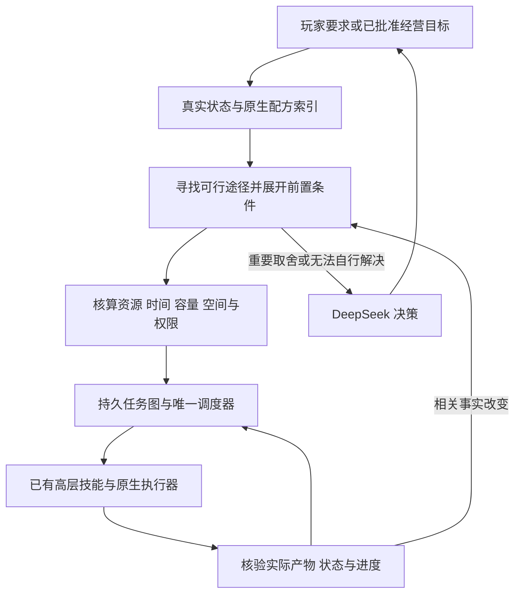

# 通用目标依赖与连续执行开发方案

日期：2026-09-21。状态：**设计方案，尚未实施或验收。**

本次仅核对代码、运行证据并制定方案。不修改运行代码，不启动游戏或测试；三天基线保持暂停，须等用户明确要求再运行。

## 1. 目标与边界

让 AI 提交一个有明确完成条件的目标，程序依据游戏真实数据，自动找到获取途径、展开材料与设施依赖、计算数量和预算、组织连续任务，核验后继续。箱子只是其中一种配方产物，不能继续用“箱子缺木材就砍树”的专用流程代表完整方案。

**通用性的标准：同一能力类型新增一条普通配方，规划器不用新增物品 ID 分支，就能读取它、展开依赖、检查可行性并调用对应原生执行器。** 新增全新的游戏机制，则需要一个机制适配器；不能假定有材料表就已经具备操作能力。

完整流程：



阶段 A 只使用一个真实玩家。小禾停止创建、运行和参与决策，保留已有存档数据；普通村民仍可作为游戏交互对象存在。阶段 B 才恢复伙伴劳动与双身体迁移。

本方案描述可扩展的完整机制，**不是提前开始阶段 B/C 的授权**。阶段 A 只接通已有执行器支持的依赖、恢复和调度；多箱整备、建筑施工整备、部分交付仍遵守 R-A5 的声明期拒绝。全成就排期、跨年经营不在本轮实施范围。

### 依据与证据口径

- [CLAUDE.md](../CLAUDE.md)：工程纪律、结构、构建及原生证据要求。
- [双身体陪玩架构方案](双身体陪玩架构方案.md)：D2/D5/D6、阶段边界、14 天门槛。
- [阶段 A 阻断修复方案](阶段A阻断修复方案-容量模型与清障寻路.md)：容量模型、反递归、根因约束、R-A5/R-A6。
- [R-A5/R-A6 交接报告](阶段A整备声明与中断修复交接报告.md)：已有实现及组合检查。本方案以最新暂停状态为准，旧报告中“三天基线正在运行”已过时。

本文“实测”仅指已有原生日志；“静态确认”指本次读到的代码行为；其余设计与效果均为待验证。

## 2. 已有基础与真正缺口

| 模块 | 静态确认的现状 | 本方案的处理 |
| --- | --- | --- |
| `GoalRuntime.ReadGoalRecipes` | 已读原生制作、烹饪配方；机器规则仅接收一部分简单确定性形状，复杂条件会跳过 | 保留读取基础；改为记录完整覆盖状态，不能把跳过解释为没有途径 |
| `GoalPlanner.Rebuild` | 已有数量展开、共享账本、防循环、在制品与预留；途径主要按 Known、类型、产量和 ID 排序 | 提升为有资源、时间、容量约束的途径选择；保留有用算法，不另起一套物资账本 |
| `GoalExecution.AgentGoalPrepare` | 能生成采集、取料、制作、加工任务；部分获取途径仍按物品 ID 分支 | 用机制适配器提供获取与执行契约，规划器不再识别具体物品 |
| `GoalAutomation` | 可自动执行目标批次；被阻碍后仍按包含日期的条件和时间间隔复查 | 改为订阅真实解除条件，并保持原目标及剩余量 |
| `AgentSchedule` | 已有依赖 DAG、角色互斥、版本校验和幂等提交 | 继续作为动作调度底座；补充计划连续性、前置依赖及恢复语义 |
| `AgentWorkCovered` / `ObserveAgentEvents` | 空闲检测会包含当前不能劳动的小禾 | 使用统一的可执行角色集合；阶段 A 集合只有玩家 |
| `OperatingOpportunities` | 会因地图存在采集物推荐出行，采集候选采用固定 45 分钟估值 | 候选必须先通过用途、真实路程、容量及主任务约束 |
| `CapacityModel` / `LoadoutPlan` | 已有有序容量模拟、双容器存取顺序 | 作为所有计划的共同约束，不再增加旁路容量规则 |
| `StorageExpansion` | 已有原生制作、放置、仓库选址；仍有箱子、木材专用流程 | 逐步保留原生执行与选址，计划依赖迁入通用机制 |
| `FarmPlanningRuntime` | 已有连片布局、通行保护、季节/照料估算；当前候选主要来自已有种子 | 作为空间与种植能力适配器；不能宣称已完成采购和加工收益联合优化 |
| `MemoryArchive` / `ContextCompression` | 已有证据存档、检索与上下文压缩 | 增加任务图摘要、相关条件订阅和版本，不用聊天记忆替代库存 |

**结论：不是从零开发一个规划器，也不是再包一层提示词。缺的是把现有机制统一成“目标、前置条件、实际效果”一致的执行系统。**

### 本轮问题的原生证据

运行 `cfbf9a8550eb4bc6a4590b8f8a7aa949`，证据在 `work/RA56Mods/Together/logs/449646917/` 与 `work/ra56-baseline-3days-1/`，不进 Git。

- 16:30：产生 `capacity_all_candidates_infeasible`；没有指定仓库，扩容材料不足。
- 17:30、18:00：模型描述社交，实际提交采集，因相同容量条件被拒绝。
- 18:40：提交返家；19:00 仍在行走时再次请求模型；19:10 模型取消返家。
- 当时背包 12/12，木材 7；不能把“去存货”当作已经可行的恢复方案。
- 用户要求暂停后已暂停；只完成第 1 个游戏日，不构成三天基线或 14 天证据。

这些证据分别暴露目标与调用不一致、声明失败没有闭环恢复、任务过度重规划。不能只归为模型不聪明。

## 3. 数据建模：配方是途径，目标是需要满足的状态

### 3.1 目标不能只有一个物品名字

提出的 `GoalSpec` 至少包含：

| 字段 | 用途 |
| --- | --- |
| `goal_id` / `revision` | 持久身份与修改版本；子动作变化不更换目标身份 |
| `desired_state` | 明确完成谓词：拥有、原生制作过、放置完成、设施可用、交付完成等 |
| `quantity` / `quality` / `location_scope` | 数量、品质和地点要求；不能混淆现有总量与新增量 |
| `purpose` | 为什么需要这项结果，以及它服务哪个经营目标 |
| `deadline` / `priority` | 时限、重要性与可延后条件 |
| `authority` | 已批准资金、材料用途、土地范围、扩建设施等权限 |
| `budget` | 时间、体力、资金和允许的不确定性；保留已承诺农务与返程资源 |
| `completion_evidence` | 需要哪些原生观测；计划文本和调用成功提示不算完成 |

“拥有一个设备”和“设备已放置且可以生产”是不同目标。后者会自然产生设备获取、选址、放置、可交互性验证等依赖，不需要为每一种设备编写整个流程。

经营政策可以提出一般性的维护目标，例如“已批准生产计划所需的仓储可用”“明日农务具备工具和补给”。政策规定需要什么服务；配方索引负责寻找实现服务的产物。不能因为随便一件物品可制作，就自动生成投资目标。

### 3.2 途径使用统一契约

一个 `ProductionRule` 表示一种可以改变世界状态的途径，可能来自合成、加工、获取或服务交互。字段包括：

```text
身份：规则 ID、机制类型、来源、数据版本、适配器版本
输入：物品选择条件、数量、品质、原生扣料顺序或其核验方式
条件：配方解锁、工具、地点、季节/天气/时间、设施、权限
占用：机器、土地、交互站位、行动者、工期或运行时长
效果：确定产物、条件产物、随机产物、被消耗物、状态变化
成本：资金、体力、主动劳动、被动等待、运输及占格过程
执行：可用执行器、支持的请求形状、前置声明检查
验证：原生回执、库存差异、设施状态、原生进度证据
```

一次规则的多个输入必须同时满足；同一个结果可能有多条替代途径。机器、工具是可重复使用的资源，不是每个批次都消耗一台。

`Known` 不再同时承担“配方知道了”“已解锁”“存在设备”“可以执行”四种含义。分别记录这些事实；任何一项未知都不能当成满足。

### 3.3 库存、承诺、预测分开

真实库存记录物品实例/槽位、容器、品质、变体、数量、可达性与观测版本。数量核算至少分成：可立即使用、已预留、在制、在途、预测。

当前缺口按实际库存和其他目标的承诺计算；在制品仅形成等待或收取依赖，不能直接作为已到手材料。预计夜间销售收入不能提前花。

规划过程中使用账本副本。候选途径落选时，其临时占料全部释放；只有选定且已授权的计划才能建立真实的逻辑预留。预留不是修改游戏物品，也不能让不同旧模块重复占用同一份材料。

原料被原生加工消耗时，核验配方预期消耗与真实产物；**制作不要求材料件数与产物件数相等**。背包与箱子之间的转移则必须守恒。两种核验不得混用。

## 4. 数据如何进入系统，而不逐物品写流程

规划器只面对上述契约，不依赖物品名称或固定 ID。接入层按游戏机制分工：

| 适配器职责 | 读取和提供的内容 | 自动适配的范围 |
| --- | --- | --- |
| 配方转换 | 原生制作、烹饪数据和当前角色的解锁状态 | 相同原生格式的新增配方、材料或产量变化 |
| 机器生产 | 机器触发条件、输入、燃料、产物规则、时长和实际机器状态 | 已支持语义中的新增机器规则 |
| 世界资源获取 | 真实对象、地形、作物和已核实掉落语义；绑定所需工具与劳动执行器 | 能由已接入机制识别的新资源实例 |
| 生长供给 | 生长阶段、季节条件、种子、照料、土地与未来实际收获 | 已支持的种植生产流程 |
| 交易与服务 | 已知营业条件、报价、可用库存、费用和原生服务界面 | 有执行能力且获授权的获取/服务途径 |
| 放置与设施 | 原生放置条件、占地、交互站位、设施实际提供的能力 | 可由现有放置执行器操作的物品 |

这张表是机制接口，不是要把物品挨个抄进清单。现有 `ResourceRules` 等原生特殊机制适配可以暂时保留在边界层，附来源与验证状态；不能把其中的 ID 判断继续复制到规划、候选、恢复和提示词里。

设施“提供什么能力”由原生类型、机器规则和经过核验的机制适配器推导，不能凭名称包含“箱”“炉”等字猜测。执行器声明应能回答 `Supports(请求形状, 当前阶段)`；解析成功而请求形状不支持，仍然不能排入可执行队列。

静态规则版本与玩家动态条件分离：游戏数据失效时重建相关索引，配方新解锁、工具升级或机器状态变化只更新相关事实。读取到一个未解锁配方，既不能当成已会制作，也不能把它永远缓存成不可用。

### 4.1 条件、类别材料与随机产物

材料选择器支持精确 ID、原生类别、标签和品质条件，沿用原生语义。含类别材料的配方要联合分配输入，防止一件物品同时满足两个材料槽。可以采用有容量限制的匹配或有界回溯，不能依靠贪心顺序默默重复使用。

完成分配后，还必须核对原生实际扣料次序。若原生会优先消耗被保护的同类物品，先通过受支持的整备隔离物品，或拒绝这条途径；不能在规划副本里选了普通材料，执行却消耗珍贵材料。

条件分为已满足、未满足、未知。能安全读取的原生条件在主线程求值；会改变 RNG、库存或世界的执行函数不能被拿来“试算”。后台规划只使用不可变数据快照。

随机掉落和随机品质记录预期、已知边界及不确定性。预计获得量用于成本比较，不能作为完成证据；每批执行后按真实所得重算剩余量。副产物同样进入容量规划和掉落收尾。

### 4.2 可扩展不等于无限兼容

原生配方表并不包含所有资源来源、剧情解锁、建筑施工和自定义 Mod 回调。针对这些内容，适配器必须返回明确支持状态：

```text
可解析且可执行 / 可解析但尚未解锁 / 可解析但缺执行器
条件待观测 / 语义不支持 / 数据无效
```

保留所有被跳过规则的 ID、来源与原因。自定义回调未适配时，不能推断它“应该和普通机器一样”。同一格式的新配方可自动加入；新机制需要适配器，这个边界必须对模型和报告可见。

百科和规划器共享规则索引与来源。百科负责检索和解释，规划器负责形式化约束；不从百科自然语言回答中猜执行参数，也不需要为此引入 BM25 或向量数据库。

## 5. 通用求解：按需展开、有界选择、逐步核验

### 5.1 反向找到前置，正向验证执行

对一个未满足目标，从“什么规则能产生所需效果”反向查询。每个候选继续展开材料、工具、设施和地点条件，形成 AND/OR 依赖图：同一规则的前置都要满足，多条规则只需选择其中一条。

选定途径后，形成可执行 DAG；再按真实行动顺序模拟资金、材料、容量和时窗。**材料树正确不代表执行顺序可行。** 例如所有材料最终都够，运输中间仍可能装不下。

```text
Reconcile(goal, snapshot):
  从原生事实判断目标是否已满足
  查询能够满足未完成谓词的规则
  剔除权限、当前阶段和执行形状不支持的规则
  在独立账本副本中展开各规则的前置与替代来源
  合并可共享的需求，计算批次、设施占用和资源承诺
  正向模拟候选计划的有序容量、预算、时窗与站位
  保留成本可解释的可行方案；有重要取舍时交给模型
  提交持久依赖图，向现有调度器投递当前可执行的短前缀
  用真实回执更新进度；只重算受影响的节点
```

这是提出的算法契约，不是当前已实现的函数。

### 5.2 数量与共享不能靠简单递归相加

确定性产量为 `q`，净缺口为 `d` 时，批次为 `ceil(d/q)`。共同材料需求在途径选定后汇总，已有库存只分配一次。多产出的余量回到逻辑可用库存，不应让另一个子树再次制作。

相同中间产物可以共享，但有不同品质、交付地点、归属或时限的需求不能盲目合并。共用设施按可用时间分配批次，不因两条依赖都需要设备而制造两台。机器等待期间释放玩家行动占用，产能占用继续保留。

需求模式必须明确：

- 达到总库存：依据当前实际可用总量持续补缺。
- 本目标新增获得：依据已核验回执和真实变化核算，不能把已有材料算作新劳动。
- 制作/交付/放置：依据相应原生记录或世界对象核验，拥有物品不能代替行为。

父目标只在它的完成谓词满足后结束。中间材料被后续节点正常消耗，不能被误判为“又缺了”而重开已完成节点。

### 5.3 循环依赖与计划规模

对依赖图做循环检测，并记录所处的事实条件。不能仅因为物品再次出现就判定所有途径失败：合法的循环生产可能有初始投入和真实净产出，应表示为有前置种源、有限批次的生产过程；没有启动资源的自举循环不能执行。

每次求解设展开节点、候选数、时间预算及取消机制。达到预算返回 `planning_budget_exhausted` 与未求解部分，不宣称世界无解。允许继续求解或选择另一已完整证明可执行的独立分支，不能执行尚未通过前置和授权检查的半截计划。

仅展开当前目标相关规则，不每帧搜索全游戏。把长程需求保存在目标层，当日动作仍通过现有有界队列执行；次日从真实状态续接，不把旧动作列表原样重放。

### 5.4 怎样选择途径

首先过滤硬约束：执行能力、权限、季节、预算、工具、容量、可达性、已承诺资源与必要农务。硬约束失败不能用高收益“抵消”。

可行方案再比较主动劳动、实际运输、现金支出与回款日期、被动等待、风险、复用现有设施的收益。保留少量互不明显劣于其他方案的选择，交给模型处理重要经营取舍。不要把尚未投产机器的未来高售价当成今天已有收益。

同一经营决策已选定后，程序自动决定材料数量、批次、站位和路线。实际结果偏离预期时局部调整，不重新推翻全日安排；切换方案还要计入已经投入的路程、整备和施工成本。

这是一种有界、可解释的规划，不承诺全局最优。

## 6. 自动设施准备：从缺少能力推导建设需求

生产规则若要求某项设施，先查询当前已存在、可达、符合条件的设施；满足则复用。没有满足条件的设施，再从“能够提供该能力”的产物索引查找候选，并展开其获取与放置途径。

因此一般形式是：

```text
需要某种生产/服务能力
  → 已有可用设施？复用，并预订相应产能
  → 没有？找到提供该能力的物品或服务
  → 已批准新增设施？展开获取依赖，否则提交经营取舍
  → 获取所需资源和产物
  → 选择合法位置，完成原生放置或服务交互
  → 观察到设施确实可用
  → 恢复原生产目标
```

不是每个配方都应自动增加设施。新增设施需属于已批准目标和预算；有现成设施只是暂时忙，应比较等待和扩容成本，而不是重复建造。基础仓储可由既有 `Storage.AutoExpand` 与预算授权；其他设施沿用各自已有授权，没有授权时不由依赖算法自行开支。

物品制作放置与木匠建筑施工分属不同原生机制：两者可以用同一目标/依赖接口，但执行器和完成证据不同。建筑还需要报价、占地、服务时间及原生工期。**阶段 A 不因统一接口就绕过“建筑整备待阶段 B”的限制。**

### 空间也必须进入计划

保留现有农场主田、道路、仓库、生产区及保护区。设施选址比较住宅、田区、原料源与生产区之间的运输成本，并核验入口、站位和未来可达性。

规划预留位置不是提前放置真实物体。执行前重查原生放置条件；被占用时只重新选址或调整相关依赖，不撤销整个生产目标。

农田布局继续由 `FarmLayout`、`FarmDistrict` 和生长计算承担，连片扩展、优先补空位，扩种数量受持续照料能力约束。必要清障是布局前置，必须纳入体力、掉落及时间成本；远离计划用地的额外清理不能优先抢占农务预算。

R-B1 的“路径遇障自动挖开”仍在 14 天闸门之后。本轮只调用已支持的指定区域劳动，不借目标规划提前改造寻路。

## 7. 容量、整备与依赖规划必须贯通

### 7.1 按任务段整备，而不是每次动作都回仓

程序根据将要执行的一段连续任务生成携带清单：必要工具、消耗品、允许补给、已承诺交付物和预计产物容量。将无关物品识别为可存放，但只有确有需要、总运输成本更低或本来经过仓库时才执行。

没有容量压力、没有缺工具材料时，继续当前任务。不能“离仓库近就存”，也不能“挖完一块就重新整备”。任务产生的材料在该任务段内保留；卸货后续接相同目标和剩余量。

使用 `CapacityModel` 按原生顺序模拟取料、扣料、生成、入包、放置和交接。使用全部原生容量，不增加统一固定留空格规则；所需余量来自该任务的具体产物和不确定性。

恢复是否有效，以“原来受阻的下一段操作现在是否可行”为准，不能一律要求空格数增加。让已有堆叠容纳所需产物、将材料投入获批准生产，或者建立可用仓储，都可能满足前置；反之腾出一格也不一定装得下下一段产物。

完整模拟必须包括已知副产物、品质分堆、工具与不可堆叠物品、机器产物和原生临时持有物。采集不只是目标材料入包，也包含真实散落物的收尾。

### 7.2 从“拒绝满包”变成“解决执行前置”

容量条件不满足时，返回结构化前置缺口。一般规划器可以在当前已批准目标中寻找能消耗物资、恢复容纳能力或提供仓储的途径，再生成一个正常的前置任务链。

原有 R-A2 腾格决策器仍只处理当前可直接执行的一层恢复动作，深度上限仍为 1。多步资源准备在正常目标层展开，**不能让腾格函数递归调用自己**。

转换过程：暂停原任务并保存续接点 → 终止当前一次腾格解析 → 将缺少的能力或材料记录为父目标的前置 → 通用规划器一次性校验依赖链 → 可执行则入队，否则形成结构化阻碍。

这不是换个函数名绕过反递归：前置链必须没有未解决的容量循环，且携带同一根因及条件版本。相同条件下的同一失败链不能反复展开。

### 7.3 不将一次满包失败泛化成“什么都不能做”

某种新物品装不下，不意味着已有堆叠也不能继续增加。约束必须通过该候选的有序容量模拟判断是否适用。

但“木材能叠进去”也不等于砍树一定安全：还需要核对副产物、掉落收尾、体力和运输。可证明能执行的采集前缀才允许开始；未知产物按适配器提供的保守边界或显式风险政策处理，不能假定没有副产物。

假设某配方还缺 `d` 份原料，规划器应从真实资源来源中寻找当前可收集的数量与路线，不硬编码“必须砍几棵树”。不足时只推进可行前缀并保留剩余需求；没有可行前缀时明确阻碍，不能用丢弃或伪造物资解决。

出售、购买背包升级仍需要显式授权或已批准政策；工具、任务物和承诺材料继续保护。默认销毁、乱送礼、为腾格吃掉受保护物品均禁止。

### 7.4 转移异常沿用 R-A6

整备开始前验证完整请求形状。不支持的形状在第一件物品移动前拒绝，不为了让计划“看起来通用”拆成多个动作绕过限制。

发生转移异常，先核对真实双方库存守恒；成立则重读、释放失效预留并局部重算，保留已完成的原生转移；不成立或无法核验则停机保留证据。不得自动写回旧快照来假装回滚成功。

## 8. 唯一调度权与持续执行

目前主循环会推进日常、经营、投资、清理、共享目标及模型任务。新设计要求这些模块只产生需求、候选和已核验事件，由一个调度入口决定谁占用玩家。允许渐进迁移，不能短期内再加入一个与旧模块并行抢角色的总控制器。

### 8.1 持久任务状态

任务采用明确状态：已计划、等待依赖、可执行、执行中、核验中、等待原生事件、受阻、完成、取消。区别“工作执行完”与“目标已完成”，并保留 parent goal、稳定 node ID、尝试号、原生命令 ID、实际结果和续接点。

仅将当前可执行的短前缀编译成 `AgentTaskSpec`。长依赖图、目标版本和承诺持久保留；次日队列时间窗失效不代表丢弃整个目标。重载后先核对原生事实与进行中的命令，不假设任何跨进程动作恰好执行一次。

新增计划存档带 schema 版本，兼容读取旧目标、任务与预留。旧数据不能可靠映射时保留原文并标记需重审，不自动重放、清空库存或伪造完成记录。迁移后同一目标只由新旧入口之一负责执行。

机器运行和作物生长属于被动等待，可以同时安排其他工作。玩家行走、挥工具、存货属于当前执行链，不能为普通候选随意打断。

### 8.2 执行连续性与取消

同一个连续任务优先接下一可行节点；维护动作保存父任务，不创建一个毫无关联的新计划。允许改变计划，但取消正在执行的任务必须附原因和相关事实：玩家要求、危险、原前置失效，或有时限的重要机会确实需要取舍。

普通社交愿望、看到另一张地图有花、仅因模型返回了新建议，都不是取消当前任务的充分理由。发出取消请求后等待原生执行器确认安全终止，再释放资源与派新动作；不能边取消边复用同一行动者。

### 8.3 哪些事件需要模型

模型负责选择目标、重大投资、互斥路线和程序无法解决的经营冲突。程序负责数量计算、普通前置补齐、连续劳动、补水、整备、拾取、有限重试和原生完成核验。

空闲、子动作结束或一次声明拒绝，首先唤醒确定性调度；只有已批准目标中没有可执行工作、也没有可完成的前置链，才形成一次带具体问题的模型请求。

模型请求可异步，但返回时核对存档 epoch、目标版本、队列版本和相关事实。过期回复不执行。它可以为以后排候选，不能靠普通回复替换仍有效的当前任务。

## 9. 单玩家阶段彻底消除伙伴干扰

定义唯一运行角色集合 `ActiveActors`。阶段 A 只包含玩家，所有候选、租约、空闲检测、模型上下文及工具允许范围均从这个集合派生。

小禾在该模式下不生成身体、不更新自主系统、不进入候选，不继续发送角色聊天或跟随唤醒。旧伙伴任务在安全停止后变为暂停并释放调度占用；数据和真实库存不删除、不清零。若需要处理既有持物或交接，先保留状态并核验，不能卸载身体时丢失物品。

将规划面板所需上下文从 `Current` 伙伴状态中解耦，避免停用伙伴后为了显示计划又隐式创建小禾。保留模型对玩家的简短说明，但它属于执行状态说明，不伪装成一个仍在场的伙伴行动。

伙伴数据格式及未来 D2/D5/D6 约束不变。恢复阶段 B 时再接入受验证的能力集合，不能仅把 actor 字符串加回来就视作双身体能力已完成。

## 10. 经营排序：先有用，再顺路，再考虑可选活动

候选来自目标依赖和世界事件，不再以“哪里有东西”作为主要派工理由。

必要照料、时限任务与已批准生产链的前置构成主要工作；程序计算时间、体力、资金、容量和返程余量，再比较可选活动。当前待执行工作若依赖清障或仓储，应推进这些前置，不能把前置与父任务互相让路形成死锁。

路线成本由地图出口、当前可达路径、工作站位及往返目的地估算；未知路线标记未知，不能用所有地图相同的 45 分钟替代。阶段 A 复用现有寻路，不同时加入 R-B1。

劳动产生的掉落属于当前任务收尾。环境中的额外采集物只在确有用途且顺路、对时限有价值，或主要工作没有可执行项时进入候选。无用采集不能占用关键材料的运输空间。

种植与加工候选沿用同一账本：种子和材料成本、成熟窗口、未来照料、加工产能、预计回款分别计算。比较收入时区分现金、库存和资产；不为凑忙碌时长乱清图，也不因一个播种子任务完成就提前睡觉。

确定收工后，返家、上床、结算、保存为一个持续安排，普通可选采集不能再次抢占。睡眠由原生流程完成，不能改时间刷天数。

## 11. 根因记忆、等待与上下文压缩

### 11.1 根因约束是可执行事实

失败记录绑定 actor、根因、受影响的操作前置、相关事实版本、解除条件、证据 ID。声明失败和执行失败都进入统一记录，重复读取同一回执不重复计数。

例如某仓库不可达，约束绑定该仓库与路线状态；某新物品装不下，约束绑定其容量需求及库存版本。无关的对话或过夜不能解除它。现有容量版本继续复用，目标层不再另设“第二天自动忘记”的重复失败缓存。

重新请求同一操作不创建新的物理问题身份。根因条件未变，不重新执行或反复让模型碰壁；选择仍通过全部检查的其他工作。达到既有连续三次同处阻断的停止规则时停下报告，不靠改工具名逃避计数。

### 11.2 每个等待必须有唤醒来源

等待记录必须说明：等谁、等什么事件、预计时间或下次检查条件、有没有其他工作可做。自然生长、机器出炉、营业开始有真实事件来源；“等背包腾空间”只有存在明确执行中的腾格任务或外部操作来源才成立。

没有解除来源的等待归为受阻。确定性调度先尝试其他可行依赖；需要经营取舍时只发一次包含可选方案的请求。不能把 20 秒退避当作完成恢复，否则只会每半个游戏小时重复同样错误。

### 11.3 记忆不承担计算真相

保留三类结构化持久数据：目标与承诺、已核验结果和经验、条件约束。真实库存与可用能力每次从游戏重新取得。

压缩历史时，保留当前目标、剩余量、选定途径、资源预留、实际阻碍及解除条件。旧对话转为带证据 ID 的摘要；不能把“打算做”压缩成“已经做了”。

给 Flash 的默认上下文是相关目标与差异，不发送完整配方全集、地图坐标和所有历史。需要比较途径时才发送几项可行方案及成本；完整规则通过百科和目标查询按需获取。上下文超预算要显式说明省略位置，不能截断工具参数或关键约束。

## 12. 模型接口和面板的一致性

复用既有 `goal.*`、`plan.*`、`work.run` 接口；优先将普通经营请求收敛到“提出目标→读取/选择方案→执行目标→查询状态”。新字段通过兼容扩展加入，不再平行引入另一套无人管理的任务 API。

模型仍可查询工具、百科和状态，但不能靠描述文字替代实际效果。每个能力契约声明自己可以产生哪些效果；若目标是社交，而选中的操作只能采集，编译期就判定效果不匹配，并引导查询正确能力。不能只用关键词比对中文句子决定匹配。

右侧半透明面板继续保留滚轮，只显示：当前目标、正在执行的步骤、实际进展、下一步、具体阻碍与恢复动作。候选建议和已经开始的动作分开标明。

例如有材料缺口时，显示“准备设备材料：还缺多少，当前在收集哪一项”；没有可行途径时，显示“缺少什么条件、已改做什么”。不展示原始 JSON，不显示没有真实对应动作的“正在帮忙”，也不展示模型的内部思维链。需要的调试证据写入日志。

## 13. 性能与可观察性

配方解析按游戏数据版本缓存；地图与库存按相关变化更新，避免每次模型请求全量扫描。主线程只读必要的游戏事实并冻结快照；图搜索、成本比较、摘要压缩在纯数据上运行。

规划分片、有预算和取消机制；后台结果返回后重新检查版本，不能将后台捕获的游戏对象跨线程读取。下一动作可以预先准备候选，但只在上一动作真实完成、状态更新后启动。

日志以 `run_id → goal_id → node_id → attempt_id → command_id` 串联，记录选择依据、备选排除原因、资源预留、预测与实际消耗、途径切换原因、阻碍及解除事件。

四类性能分开记录：动作交接空档、模型网络等待、寻路 CPU 时间、Together Update 帧耗时。正常挥工具动画与无意义空档分开。Together Update 指标不冒充整个游戏渲染帧率。

每日报告继续按 A–E：时间分解、重复失败/存货/早睡、现金库存作物资产、模型用量恢复、按形状统计的整备拒绝。运输单列，不能因为一直走路就把它算成有效经营。

G3 阈值仍由独立三天基线后用户确定。报告同时给原有“有进展任务时间”和纯劳动时间，明确各自分母；不能悄悄把指标重新定义后沿用同一个门槛。

## 14. 实施切分与旧模块迁移

以下均为后续工作，不表示已实现。每批相关修改、验证、文档更新完成后独立提交；不混入现有工作区的无关改动。

| 顺序 | 可交付修改 | 复用位置与退出条件 |
| --- | --- | --- |
| P0 | 单玩家模式和唯一调度入口 | `AutoplayRuntime`、`AgentScheduleRuntime`；关闭小禾运行，现有模块通过统一入口提交需求，保留原生执行器 |
| P1 | 统一规则与能力契约 | `GoalRuntime`、百科索引、执行器声明；数据解析覆盖可查询，未知语义可见，规划器不复制物品 ID 分支 |
| P2 | 通用局部依赖求解 | `GoalPlanning`、`GoalLedger`；支持替代途径、批次、共享材料、设施复用、循环与资源上限 |
| P3 | 将已有目标执行接入有序容量与整备 | `GoalExecution`、`TaskPreparation`、`CapacityModel`、`LoadoutPlan`；已支持的采集/制作/加工/放置链可连续执行，保留 R-A5/R-A6 |
| P4 | 事件恢复、任务稳定性与模型入口 | `GoalAutomation`、`AgentDecisionPacing`、失败约束；消除无源等待、同因反复声明和无故取消 |
| P5 | UI、日志与经营候选统一 | `OperatingOpportunities`、`AgentOverlay`、`MemoryArchive`；效果一致、路线成本可解释、证据可回查 |
| P6 | 集中组合检查与修复 | 同一已构建版本尽量一次启动成组验证，不做一项就重启 |
| P7 | 用户明确要求后，独立三天基线 | 不计入 14 天；按 A–E 提供数据并等待 G3 裁决 |

P1–P5 的阶段 A 实现只覆盖当前执行能力内的局部前置规划，不引入全成就图或新施工能力。阶段 B/C 继续以同一契约扩展能力与长程排期，不再重写依赖内核。

旧的箱子专用入口可暂时作为兼容入口，但必须委托统一目标，不再自己另派采木任务。其他旧入口同样逐个移交调度权。新增机制启用时，对应旧派工路径必须停用，不能同时争抢同一角色。

复用已有域检查、模型失败降级、夜间守护和原生执行回执。新增纯文件必须手写进入 `tests/Together.DomainChecks.csproj`，并挂入检查入口。作用域纪律、AgentLab 门禁、上游锚点补丁、零伪造红线完全保留。

### 分阶段待办

- [ ] 单玩家角色集合统一，小禾运行与唤醒均关闭，存档数据保留。
- [ ] 规则索引、能力声明和解析缺口可查询；普通新配方无需规划分支。
- [ ] 目标完成谓词、需求量、在制品与共享预留统一。
- [ ] 有界依赖求解、替代路线、批次与设施占用接通。
- [ ] 任务级容量模拟、整备与普通前置准备贯通。
- [ ] 声明拒绝和执行失败进入同一根因约束，等待均有解除来源。
- [ ] 调度连续性、模型唤醒和安全取消符合本方案。
- [ ] 地图候选、布局、收尾拾取和运输成本服从当前经营目标。
- [ ] 面板根据真实步骤显示，日志与持久记忆可追溯。
- [ ] 集中组合原生检查通过，无新增必经人工操作。
- [ ] 用户授权后完成独立三天基线与 A–E 报告。

## 15. 如何证明它是通用机制，而不是另一份物品清单

### 15.1 纯算法检查

生成不同形状的抽象规则图：共享中间物、替代输入、多产物、有限机器、合法循环、不可启动循环、随机产出、过期事实和容量变化。自动检查资源不能重复分配、完成不能靠预测、预算不能超支、失败不改变真实世界等不变式。

使用变换检查：只改变物品 ID 而保留规则结构，计划应仅发生对应重命名；改变配方材料或产量，材料缺口和批次数应自动变化；新增同结构配方，核心逻辑无需改动。该检查最直接证明没有靠列举箱子、设备名称来实现“通用”。

模拟多箱形状时，阶段 A 应得到声明拒绝，不能把域算法能找到路线当作运行期已支持转移。未知条件必须得到未知/需观测，不得默认通过。

### 15.2 集中原生业务链检查

先做不使用 LLM 的确定性端到端检查，再用 Flash 验证目标提出与途径选择。前者用于确认底层能独立把批准的目标完成；后者用于确认模型可以使用这套机制。两者不能互相冒充。

从当前存档实际可行规则中选取不同机制的目标，验证前置获取、转换、放置或生产、交接、续作。选择按规则结构和机制覆盖，不把测试样例名称写成产品代码分支。

同时组合满包/副产物、缺材料、已存在设施复用、普通补水、暂停重载、目标失效、同根因重复拒绝与途径切换。只在 AgentLab 三重门禁内运行夹具；需要中后期条件的场景使用合法进度存档，不直接写经验、配方、金钱或完成标记来凑条件。

整备与存取要求完整前后库存及守恒证据；转换要求原生扣料、产出与相应计数；设施要求真实对象和可用状态；续作要求原目标 ID、已完成量与剩余量连续。

已通过的底层原生检查不无故全部重跑；只有本次修改影响其假设时才补回归。独立基线另起存档，组合检查不拼接成连续运行证据。

### 15.3 不得降低的最终门槛

三天基线仍需用户明确授权后启动。三天数据提交后，由用户确定 G3；之后才运行独立连续 14 天、0 重启验收，并继续满足 G1/G2/G4。未过闸门不进入 R-B1 或阶段 B。

组合检查和基线均保持正常游戏时间与原生动作，不重新启用此前取消的时间加速。人工操作、重启、代码热换或故障注入的运行必须单独标记，不能计入无人介入基线或验收。

任一环节连续三次仍卡在同一处，停下报告实际条件、已尝试途径与原生证据。不得通过改时间、复制物品、重置失败记录或拆分拼接运行绕过门槛。

本方案的成功标准不是“模型说自己会建造”，而是：**目标所需的真实前置能够从数据推导，程序持续执行并核验，结果不足时继续补缺，不能执行时准确说明阻碍；普通配方变化不需要再写一条人工流程。**
