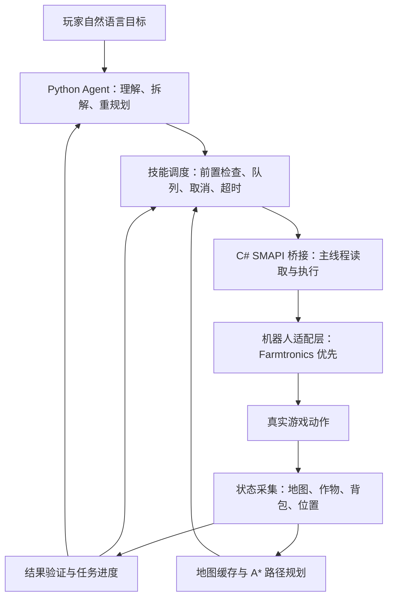

# 星露谷 Agent 开发方案

更新日期：2026-09-18  
项目定位：基于真实游戏状态、可执行任务并验证结果的农场 AI 队友。  
本文为方案基线。当前已完成阶段 0 和阶段 1 的真实游戏验证，详见 [阶段进度](docs/阶段进度.md) 与 [验收报告](docs/阶段1验收报告.md)；其余内容仍为后续计划。

## 1. 最终要做成什么

玩家输入一句话，例如：

> “先把这片地浇完水，再收获成熟作物。路上遇到障碍就绕开。”

游戏中的机器人读取地图、作物和自身状态，生成任务计划，实际移动和干活，并用游戏状态确认是否完成。玩家临时说“先回来”，它能够在安全动作边界暂停、返回，并保留剩余任务。

稳定后再扩展到两个机器人：一个浇水，一个收获；共同使用任务清单，避免重复劳动。**“一起下矿”、战斗、钓鱼、复杂跨地图导航不列入首版。** 先让农场内的小闭环可靠，演示效果会比同时实现很多不稳定功能更好。

这个项目不依赖截图、OCR 或视觉模型。录像只用于展示，不参与 Agent 感知。目标是一个真实的 Agent 闭环：

**理解目标 → 读取状态 → 制定计划 → 调用技能 → 检查结果 → 必要时调整计划。**

## 2. 核心技术选择

### 2.1 推荐组合

**Farmtronics 机器人 + 自己的 SMAPI 状态/动作桥接 Mod + Python Agent。**

- **Farmtronics**：优先复用游戏里可见的机器人及已有动作能力。
- **SMAPI 桥接 Mod**：读取游戏对象、地图和背包，将外部命令送入游戏主线程，返回可验证的执行结果。
- **Python Agent**：理解自然语言、拆分任务、选择技能、维护任务进度和处理异常。
- **普通算法**：负责格子寻路、可达性判断、资源计算、目标分配和重试限制。
- **LLM**：只处理目标理解和需要判断的重规划，不逐帧控制角色。

首版只接一个支持结构化输出或工具调用的模型。通过统一接口保留更换模型的能力；不训练模型，不先搭建复杂多 Agent 框架。

### 2.2 这些开源仓库分别用在哪里

| 项目 | 它实际提供什么 | 本方案怎么使用 |
|---|---|---|
| [Farmtronics](https://github.com/JoeStrout/Farmtronics) | 游戏内可编程机器人、MiniScript 环境及地图/机器人接口 | 主要底座候选，优先复用机器人与动作 |
| [StardewValley-MCP](https://github.com/amarisaster/StardewValley-MCP) | 将 SMAPI 游戏状态和操作接到 MCP，并包含伙伴角色实现 | 参考接口设计，保留为备选；不与 Farmtronics 两套角色系统一起集成 |
| [SPIKE](https://github.com/wencanjiang/SPIKE) | 包含多模态观察、长任务规划、执行与反馈的研究型 Agent 系统 | 借鉴分层规划与失败重规划思路，不作为运行依赖 |
| [Stardew Access](https://github.com/stardew-access/stardew-access) | 从游戏内部读取环境信息，提供对象追踪和导航等辅助功能 | 参考状态读取和导航设计，不要求玩家安装 |
| [Automate](https://github.com/Pathoschild/StardewMods/tree/develop/Automate) | 箱子与机器之间的规则化生产自动化 | 后续“生产计划 Agent”的参考，首版不接入 |

因此，**不是把 SPIKE、StardewValley-MCP 和其他 Mod 全部拼起来**。新的约束是非视觉、快落地，所以只选一个角色底座，自己补必要的 Agent 能力。

MCP 只是把能力暴露给模型的接口协议，不会自动提供规划、记忆、可靠执行或多机器人协作。首版使用本地接口即可；演示闭环完成后，再按需要包装成 MCP 工具，避免同时维护 C#、Python、Node 三套运行环境。

### 2.3 已有证据与必须实测的边界

此前已检查上述官方仓库、相关文档和部分源码，但尚未运行游戏验证。

Farmtronics 的 [API 文档](https://github.com/JoeStrout/Farmtronics/wiki/API-Reference) 提供地图尺寸、格子信息、机器人位置、背包、能量以及移动、工具使用、收获等能力。文档中的 MiniScript 接口**不等于已经存在可供外部 Python 直接调用的公共 C# API**。能否低成本从桥接 Mod 控制机器人，是第一阶段必须验证的内容。

已有资料确认的正式发布 [v1.4.1](https://github.com/JoeStrout/Farmtronics/releases/tag/v1.4.1) 标注适配星露谷 1.6.9；不能据此假定兼容本机任何版本。实际游戏、SMAPI、Farmtronics、操作系统与 .NET 版本需要记录并实测。

另外：

- 格子查询可能对空地返回 `null`，不能简单当作“不可通行”；碰撞必须结合真实地图与游戏判定。
- 作物可收获应检查实际可收获状态，不能仅判断生长阶段或名称。
- “从箱子取物”有文档依据；“可靠存入指定箱子”的具体调用路径仍需验证或补实现。
- StardewValley-MCP 的部分动作回执只表示命令已发出；已检查的部分寻路异常分支会直接修改位置。若采用它，必须补完成反馈并移除把传送当寻路成功的处理。

## 3. 首版范围与完成标准

### 必须完成：单机器人闭环

1. **结构化感知**：农场格子、障碍、作物、机器人位置、工具、背包与能量。
2. **自然语言任务**：至少支持浇水、收获、暂停、返回、继续。
3. **真实执行**：机器人正常移动、使用工具和收获，不通过直接改坐标或改作物状态伪造完成。
4. **状态校验**：根据浇水状态、作物变化、物品变化和位置判断效果。
5. **异常处理**：遇到障碍重新计算路径；缺工具、资源不足或目标不可达时给出具体原因。
6. **中断恢复**：临时命令到来后，在安全动作边界切换任务；恢复时重新读取状态，只做未完成部分。
7. **可观察性**：展示当前目标、计划、正在执行的技能、真实结果和失败原因。

### 单机器人稳定后再做

- 双机器人任务分工与重复任务消除。
- 箱子存取、收获后的归仓流程。
- 从测试场景自动生成任务评估报告。
- MCP 封装，便于从支持 MCP 的客户端发指令。

### 首版不做

视觉识别、模型训练、开放式代码生成、多人联机、复杂战斗、钓鱼、全地图探索、长期经济最优策略、向量数据库和复杂网页前端。

首版状态读取范围限制在当前农场及明确定义的机器人信息。不会用“读取游戏状态”推导出已拥有全地图、所有实体或任意隐藏信息的接口。

## 4. 系统架构与责任分工



### 游戏端：C# Mod

- 只在游戏允许的主线程时机访问和修改游戏对象。
- 网络线程只接收与解析请求，然后写入命令队列；不直接操作 `Game1` 对象。
- 从主线程生成不可变状态快照，交给外部 Agent 读取。
- 维护执行中的动作、完成事件、取消状态和角色适配器。
- 处理读档、切换存档、退出游戏、Mod 重载等生命周期变化。
- 尽量复用已有机器人动作，不重新实现一整套游戏工具逻辑。

### Agent 端：Python

- 把自然语言转换成结构化目标，不允许模型直接生成任意游戏代码执行。
- 从已知技能中选择动作，生成短计划和明确完成条件。
- 校验模型输出与技能参数，非法输出最多进行有限次修复。
- 执行队列、验证结果；环境发生实质变化时才请求模型重规划。
- 使用 SQLite 保存任务、步骤和结果，不先引入额外数据库服务。

### 算法层

- A* 或可复用且经过验证的游戏寻路能力，负责当前地图内移动。
- 普通程序负责目标筛选、距离估算、工具与容量检查。
- 首版按就近顺序完成目标，不追求复杂全局最优。
- 模型负责“要做什么”；算法负责“哪些目标可做、怎么走、是否做成”。

## 5. 状态与接口设计

以下是**本项目拟实现的接口**，不是声称上游已经提供同名功能。

### 5.1 状态快照

建议统一输出以下字段：

```json
{
  "session_id": "load-001",
  "snapshot_id": 128,
  "game_tick": 4580,
  "location": "Farm",
  "actor": {
    "id": "bot-1",
    "tile": [12, 8],
    "facing": "south",
    "energy": 200,
    "inventory": [],
    "selected_tool": "watering_can"
  },
  "map": {"width": 80, "height": 65, "revision": 7},
  "targets": [
    {"tile": [15, 10], "kind": "crop", "needs_water": true, "harvestable": false}
  ]
}
```

数值仅为结构示例，不代表已经读取到的游戏数据。不同角色的能量机制需要适配，不将玩家体力与机器人能量硬编码为同一种机制。

读取采用“首次地图快照 + 局部刷新 + 动作前后复查”。模型只接收与当前目标有关的摘要和候选目标，完整格子数据由算法使用，避免每次将整张地图送入模型。

### 5.2 接口边界

首选只监听 `127.0.0.1` 的 HTTP JSON 接口，先使用查询状态和轮询命令结果实现闭环；确有延迟需求再引入事件推送。

| 接口 | 用途 |
|---|---|
| `GET /health` | 检查游戏已载入、适配器可用、协议版本和当前会话 |
| `GET /state` | 获取指定角色和当前地图的状态摘要 |
| `GET /map` | 获取指定范围的格子与碰撞数据 |
| `POST /commands` | 提交白名单技能，返回命令 ID 与接收状态 |
| `GET /commands/{id}` | 查询运行状态、效果证据和错误 |
| `POST /commands/{id}/cancel` | 请求在安全边界取消，并等待取消确认 |

服务不绑定公网。写操作使用本地会话令牌，日志不记录模型密钥或令牌。请求带 `session_id` 与 `command_id`；载入新存档后旧会话命令失效，避免把旧任务误执行到新游戏。

### 5.3 命令状态与真实完成

```text
queued → running → succeeded
                 → failed
                 → cancelled
```

```json
{
  "command_id": "cmd-001",
  "session_id": "load-001",
  "actor_id": "bot-1",
  "skill": "water_tile",
  "args": {"target": [15, 10]},
  "status": "succeeded",
  "evidence": {
    "before": {"needs_water": true},
    "after": {"needs_water": false}
  }
}
```

约束：

- “命令接收成功”与“游戏动作完成”严格分开。
- 重复提交相同命令 ID 返回已有状态，防止网络重试造成重复操作。
- 每个动作设置超时、最大重试次数与结束条件。
- 超时先确认取消或停止结果，再根据当前状态决定是否重试，不能让两个相同动作同时运行。
- 游戏菜单或暂停可能停止游戏时间推进；区分游戏内进度停滞与连接失效。
- 不能因重连就直接重放上一条收获、存取物品等有副作用的命令。

## 6. 技能、寻路与反馈怎么实现

### 6.1 首批技能

| 技能 | 前置检查 | 完成依据 |
|---|---|---|
| `inspect_area` | 存档与地图有效 | 返回带版本号的结构化状态 |
| `move_to` | 目标可达，有合法站位 | 最终位置满足到达条件 |
| `water_tile` | 作物需要水、有对应工具与可用资源 | 目标从需浇水变为已浇水 |
| `harvest_tile` | 目标可收获、背包容量足够 | 作物状态变化；另记录产物是否已进入背包 |
| `return_to` | 返回点有效、可达 | 到达预设位置 |
| `pause_task` / `resume_task` | 任务存在 | 动作安全停止；恢复后生成剩余目标集 |
| `deposit_items`，后续 | 容器可交互、物品允许转移 | 背包与箱子数量变化相互对应 |

收获与拾取需要区分：作物已收获但产物还在地上时，不能报告“已收到背包”。要求数量的任务，以实际获得的物品计数。涉及箱子转移时，使用物品 ID 与数量核验，不仅匹配名称。

### 6.2 路线计算

1. 将地图转成格子图，结合建筑、物体、地形和真实碰撞规则判断可通行性。
2. 为作物或箱子寻找合法交互站位，不默认角色可以站在目标物体所在格。
3. 用 A* 到达交互站位，设置正确朝向后执行动作。
4. 移动过程中检查坐标变化；动态障碍出现时刷新局部地图并重新规划。
5. 路径连续失败后将该目标标记为暂不可达，继续其他可执行目标并报告原因。

首版只做当前农场地图；门、地图传送点、矿井和室内外切换单独留待后续。路线规划器与移动执行器只能有一个当前路线控制权，避免两个寻路系统同时控制同一机器人。

### 6.3 Agent 规划方式

模型输出任务意图，例如：

```json
{
  "goal": "完成指定区域内需要浇水的作物",
  "intent": "water_area",
  "scope": {"location": "Farm", "area_id": "plot-a"},
  "constraints": {"allow_destructive_actions": false},
  "completion": {"remaining_waterable_targets": 0}
}
```

程序根据状态列出具体目标并生成技能队列。模型不需要枚举每次前进一步，也不必为每株作物重新调用一次。

区域首版通过配置中的命名地块确定，例如“东侧地块”，不先做鼠标圈选器。指令含糊且会改变执行范围时，返回一次具体澄清；不让模型猜测要砍哪棵树、处理哪个箱子。

重规划触发条件包括：任务目标变更、计划前置条件失效、有限次局部重试后仍失败、资源不足，或出现模型此前不知道的重要状态。不因普通走路或一次成功浇水反复调用模型。

### 6.4 记忆与临时改令

任务状态持久化包括：原始指令、结构化目标、完成的目标格、剩余目标、当前技能、暂停原因和失败记录。

“先回来”按以下流程处理：

1. 停止继续派发新动作。
2. 等待当前不可中断动作结束，或确认安全取消。
3. 保存任务进度，执行返回任务。
4. 用户说“继续”后重新读取地图；已被玩家浇水或收获的目标从队列剔除。

崩溃或读档后的恢复必须重新同步状态，不直接相信数据库里保存的旧位置或旧背包。

## 7. 双机器人协作怎么做

双机器人阶段仍使用**一个任务调度器**，不先给每个机器人配一个会相互聊天的独立大模型。

- 先按能力或地块分工，例如 A 浇水、B 收获；资源与工具约束由程序判断。
- 每个目标有任务归属和带有效期的领取记录，同一目标不能同时被两台机器人执行。
- 机器人停止或任务失败后释放目标；恢复时重新核对状态。
- 先通过不同作业区域降低碰撞；增加下一步格子占用检查、固定让行优先级和有限次数的退让重规划。
- 不宣称这个简化策略解决任意多机器人路径规划；狭窄区域无法通行时明确等待或返回失败。
- 主人临时改令时，统一更新任务表，再分别暂停与重新派发任务。

这已经能表现“协作 Agent”的核心：共享目标、任务分配、冲突处理、进度同步。独立人格、对话和复杂协商可以以后增加。

## 8. 具体开发顺序与阶段验收

以下是有效工作时间估算，以已获得可用游戏环境和模型接口为前提。底座兼容问题可能增加时间；每阶段以验收结果推进，不承诺按日期硬凑成功。

### 阶段 0：验证底座，约 0.5～1 天

记录游戏/SMAPI/Farmtronics/操作系统版本，确认启动、读档、机器人创建与操控条件。针对真实源码验证外部接口，优先通过公共接口；没有适用接口时，评估在明确许可下维护一个最小 Farmtronics fork，补可调用的控制接口，不优先采用脆弱反射。

必须完成四个最小实验：

1. 不用截图，读到机器人位置、目标格与作物状态。
2. 从外部程序触发正常移动，并确认到达。
3. 触发一次浇水和一次收获，并读到实际状态变化。
4. 验证暂停/结束反馈，确认游戏没有卡死或持续残留动作。

同时检查工具、水量/能量、背包机制以及箱子存取可行性，形成能力表：已验证 / 待实现 / 暂不支持。

**选型门槛：** Farmtronics 接入不通过时，不继续在它上面构建上层功能。限时评估 StardewValley-MCP 的角色执行层能否以更少修改通过同样实验；只有完成真实反馈与寻路修复后才作为替代。两者都无法通过时交付具体阻塞与范围调整建议，不把“直接控制玩家”悄悄说成“AI 队友”。

### 阶段 1：完成确定性闭环，约 1～2 天

实现状态快照、命令协议、当前农场地图寻路、浇水/收获技能和结果校验。先用固定任务驱动，不接模型，以区分游戏接口问题和规划问题。

验收：在准备好的小地块中，机器人连续完成浇水与收获；不可达目标有可追踪失败；重复命令不会重复执行。

### 阶段 2：接入 Agent，约 1～2 天

接入自然语言目标解析、白名单工具调用、任务记忆、暂停恢复和有限次重规划。使用命令行或简单本地控制面板，不先做完整网站。

验收：同一任务换三种说法都能正确执行；过程中接受“先回来”“继续”；遇到缺工具或道路变化能调整或解释。

**至此形成单机器人 MVP。底座顺利时，预计约 3～5 个有效工作日。**

### 阶段 3：增加双机器人，约 1～2 天

补任务分配、目标领取、冲突处理和协同暂停。若单机器人尚不稳定，不进入本阶段。

验收：同一地块混合任务可拆给两台机器人；不存在重复收获、重复计数或任务永久占用；记录与单机器人相同场景的实际表现。

### 阶段 4：整理评估与演示，约 1～2 天

固定测试存档或场景构建方法，输出评估报告、架构说明、安装说明、演示录像与真实限制。

目标是底座顺利时，约 7～10 个有效工作日形成适合简历和面试展示的版本。箱子归仓和 MCP 封装可按剩余时间选择，不能挤占基本可靠性验证。

## 9. 测试与量化评估

### 9.1 测试分层

- **算法单元测试**：路径可达/不可达、交互站位、重复目标消除、恢复任务过滤。
- **协议与状态机测试**：重复命令、超时取消、旧会话命令拒绝、断线后状态对账。
- **游戏内集成测试**：真实移动、工具使用、收获、背包变化、玩家修改环境后的恢复。

模拟测试通过不能代替游戏内验证。无需为每个简单数据字段写测试，优先覆盖最可能造成误执行或虚报完成的边界。

### 9.2 首批场景

| 场景 | 检查点 |
|---|---|
| 固定小地块浇水 | 所有可执行目标完成，没有把失败报成功 |
| 成熟与未成熟作物混合 | 只收获真正可收获的作物 |
| 路上新增障碍 | 绕行或报告不可达，不直接传送 |
| 工具缺失、资源不足或背包满 | 停止受影响动作，准确说明原因 |
| 工作中临时返回，再继续 | 安全切换，恢复后不重复已完成任务 |
| 暂停时玩家改变作物状态 | 恢复时使用新状态修正目标 |
| 重复提交、断开连接、重新载入存档 | 无重复副作用、无跨会话误执行 |
| 双机器人处理部分重叠任务 | 目标唯一归属、正确释放、可解释等待 |

首版做场景覆盖与重复验证；对外展示前，再对固定的一组任务做至少 3 次重复运行，保留失败。测试批次记录存档起点、游戏设置、模型及提示词版本。游戏允许共享的配置/种子与构建脚本优先入库，不上传游戏资产。

### 9.3 指标

- **任务成功率**：满足全部完成条件的任务数 / 总任务数。
- **误报成功次数**：报告完成但真实状态不满足条件的次数，验收目标为 0。
- **恢复成功率**：预设异常后成功恢复的次数 / 注入异常的次数。
- **完成时间**：同时记录真实耗时与游戏时间，区分暂停与执行。
- **模型调用数、Token 和费用**：衡量是否避免无意义的逐动作推理。
- **双机器人冲突与重复劳动次数**：检查协调是否有效。

基础对照采用相同技能和环境下的固定顺序脚本，对比动态改令与异常场景。不要声称 Agent 在固定浇水任务上必然比脚本快；它的主要优势应体现在自然语言目标、任务变化和异常恢复。

如果需要比较“有无结果校验”，在可重置的评估场景或日志回放中完成，不让没有校验的版本参与正式演示。所有简历数字必须来自真实报告，不能填预设成功率。

## 10. 演示设计：三分钟讲清楚

### 第一段：一句话干活

输入“给东侧地块浇水，然后收获成熟作物”。展示机器人动作，同时显示简短计划与真实剩余目标数。

### 第二段：临时改令与环境变化

中途说“先回来”，随后玩家改变一个目标状态或增加障碍，再说“继续”。展示它重新读取环境，跳过已经完成的目标，重新计算路线。

### 第三段：双机器人分工

在双机器人版本通过验收后，展示一台浇水、一台收获，再统一暂停。若该阶段尚未完成，演示用异常恢复报告收尾，不播放假协作。

演示界面只需要五项：用户目标、当前计划、执行动作、反馈证据、任务结果。无需公开模型的内部推理过程，用简短决策说明即可。

开发时可以准备特定测试地块和物资，但演示计时开始后通过真实动作完成。场景初始化与 Agent 操作在日志中分开，不用调试传送或改库存伪装任务能力。

## 11. 建议目录与工程约束

```text
星露谷agent开发/
├── 星露谷Agent开发方案.md
├── README.md
├── mod/                  # SMAPI 状态采集、命令执行与角色适配
├── agent/                # 目标解析、技能调度、记忆和验证
├── contracts/            # 协议 schema、错误码、示例
├── configs/              # 非秘密配置与示例
├── tests/                # 算法、协议与状态机测试
├── evals/                # 场景定义、评估脚本与报告模板
├── docs/                 # 环境版本、能力表、设计说明、演示步骤
└── outputs/              # 本地产物，默认不提交大型文件
```

先确定协议与最小贯通，再按需求增加文件，不预先生成大量空模块。

- 模型密钥用本机环境变量或忽略的 `.env` 管理，示例只放变量名。
- 运行日志、个人存档、缓存、编译输出与大型录像默认不入 Git。
- 固定已验证的依赖版本与上游提交，避免开发过程中自动升级造成行为变化。
- 错误信息区分 `unreachable`、`missing_tool`、`inventory_full`、`resource_insufficient`、`stale_session` 和 `action_timeout`，方便恢复与统计。
- 不修改无关 Mod，不把调试作弊操作暴露为模型常用工具。

## 12. 风险与处理

| 风险 | 处理方式 |
|---|---|
| Farmtronics 与本机版本不兼容，或缺少外部控制入口 | 第一阶段先验证；必要时最小 fork；未通过前不写上层大框架 |
| 游戏对象跨线程访问造成崩溃 | 网络与主线程队列隔离，状态用快照传递 |
| 动作回执与真实效果不一致 | 前后状态校验；命令接收和完成分别记录 |
| 工具/机器人语义不同于普通玩家 | 用角色适配层声明能力，逐技能实测，不照搬玩家逻辑 |
| 暂停、读档、断线造成旧命令执行 | 会话标识、命令去重、取消确认与重新同步 |
| LLM 慢、贵或输出不合法 | 短计划、结构化校验、局部算法恢复、有限次数模型调用 |
| 多机器人互相挡路 | 后置协作开发，先区域分工，再占用检查与有限退让 |
| 做了很多功能却没有稳定演示 | 先冻结单机器人场景，通过验收才扩展 |

许可证必须按实际采用的版本与文件核对。Farmtronics、Automate 所属仓库此前核查为 MIT；Stardew Access 为 GPL-3.0，不能默认把其源码直接复制进采用其他许可证的项目而无需履行义务。StardewValley-MCP 的 README 与许可证文件曾出现不同表述，需要按实际许可证文本核实后再复用。参考思想与复制源码要在记录中区分。

## 13. 与目标岗位的关系及简历写法

目标岗位：[米哈游游戏 AI 研发实习生（Agent 方向）](https://jobs.mihoyo.com/#/campus/position/8337)。根据此前核查的岗位内容，本项目能展示：

- **Agent 原理与能力边界**：结构化规划、工具调用、反馈校验、失败恢复。
- **工程实现能力**：C# 游戏 Mod 与 Python 服务协同、异步动作生命周期、状态同步。
- **游戏研发理解**：游戏主循环、格子地图、碰撞、工具和背包语义。
- **玩家体验方向**：可被自然语言指挥、能接受临时改令的队友。
- **自动化测试方向**：同一套状态和动作接口可扩展为游戏任务回归测试工具，并输出完成判定和失败证据。

这是能力相关的作品，不等同于已经覆盖岗位中的代码审查、策划配置生成或美术资产生成。要进一步贴近研发工具链，优先增加“自动任务回归报告”，而不是再接一个聊天 NPC。

可以在实现后按实际完成范围写：

> 基于 SMAPI 与 Farmtronics 开发非视觉游戏 Agent，通过结构化地图、作物与背包状态实现自然语言任务规划、算法寻路、技能执行和效果校验；支持任务中断恢复与动态障碍处理，并构建可重复的游戏内任务评估流程。

双机器人协作和量化结果仅在实测完成后添加。必须明确自己的工作是桥接、调度、校验、恢复、评估等，机器人底座来自开源项目，不能写成从零开发全部能力。

## 14. 最终交付与下一步

项目实现完成后应交付：

1. 可构建的 Mod、Agent 源码与必要的上游补丁。
2. 已验证的安装步骤、依赖版本、运行命令与示例配置。
3. 上游能力与自研能力的区分、已知限制和许可证说明。
4. 一份真实评估报告，包含失败案例及环境信息。
5. 一段三分钟左右的演示与可复现操作步骤。
6. 基于真实结果的简历描述和面试技术说明。

进入开发后，第一个里程碑是验证“读状态 → 走到目标 → 浇一次水 → 确认变化”，通过后再接 LLM。

**最快且效果最好的路线：复用机器人，自己补可靠控制接口；先做真实闭环，再接自然语言；先做稳定单机器人，再做协作和评估。**
